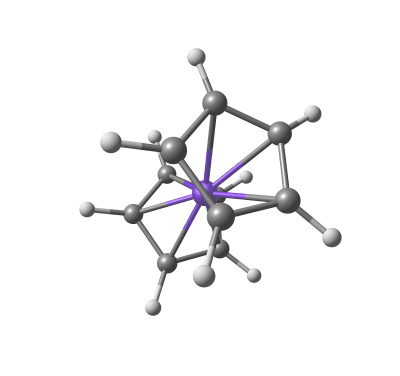
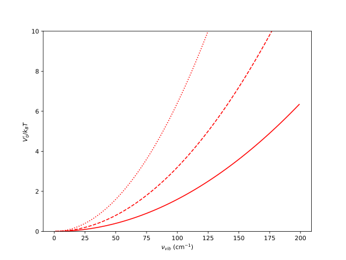
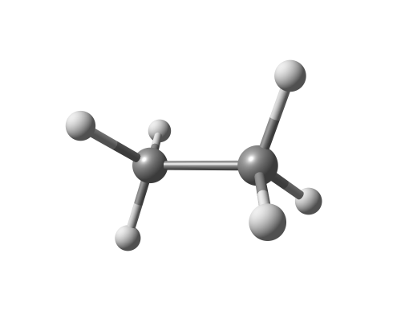
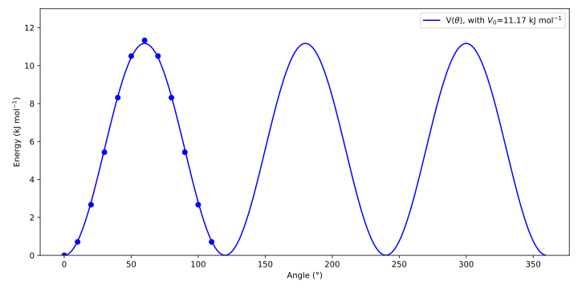
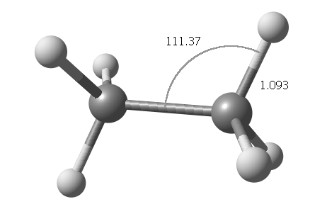
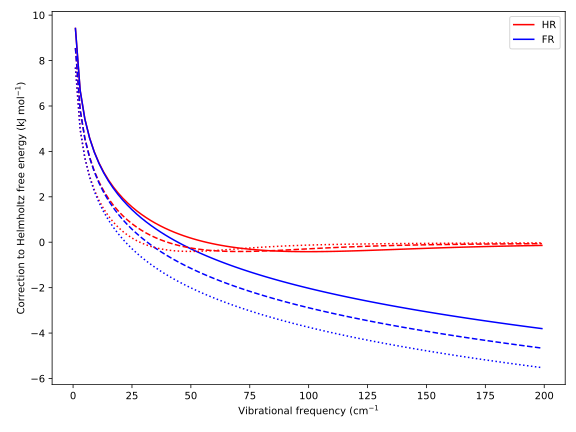
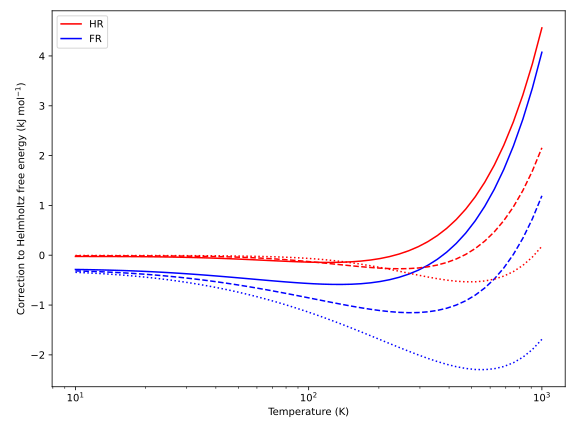

When computing thermochemical values for molecules in the gas phase (or, with some approximation, the condensed phase), we generally split the $3N$ degrees of freedom into 3 rotational modes, 3 translational modes (or 2 if the molecule is linear), and the remaining $3N-6$ [vibrational](https://en.wikipedia.org/wiki/Molecular_vibration) modes (or $3N-5$ if the molecule is linear).

The latter are typically treated using [(quantum) harmonic oscillators](https://en.wikipedia.org/wiki/Quantum_harmonic_oscillator) (QHOs). 
This treatment introduces various issues, such as the lack of anharmonicity and, most relevant to the topic at hand, the fact that it describes only a single minimum for each mode.

In organic chemistry, we quickly learn that, with sufficient energy, a single bond can rotate between multiple minima. 
For example, in ethane, there are three stable minima, known as staggered conformations.


**Figure:** The different conformations of ethane ([source](https://switkes.chemistry.ucsc.edu/teaching/CHEM1B/RotationalConformation/Conformations_of_ethane.html)).

When the energy barrier is lower than or comparable to the [characteristic thermal energy](https://en.wikipedia.org/wiki/KT_(energy)) ($k_BT$), the system can move more or less freely between minima. 
Therefore, describing this "vibration" with a QHO, which confines the system to a single minimum, becomes inaccurate.

This issue is especially relevant for most C–C bonds, as in the ethane example, but it also applies to other molecules. 
One notable example, and the one that brought me to this topic, is [ferrocene](https://en.wikipedia.org/wiki/Ferrocene). Ferrocene has a low-lying internal rotation mode around 40 cm⁻¹.



**Figure:** Visualization of the rotational mode of ferrocene (located at 31.87 cm⁻¹) as computed at the ωB97X-D/6-311G* level in DMSO (SMD).

While there are several articles addressing this issue, few delve into the detailed treatment of this correction. 
In this blog post, I explore the approach proposed in [10.1007/s00214-007-0376-5](https://dx.doi.org/10.1007/s00214-007-0376-5) for properly accounting for [hindered rotation](https://doi.org/10.1351/goldbook.F02520) when the barrier is comparable to $k_BT$.

This correction was originally treated by Pitzer and Gwinn in 1942, who provided reference tables (see [10.1063/1.1723744](https://dx.doi.org/10.1063/1.1723744)), which have since been used in many articles and computational programs.

## Theory

### The 1D-Hindered Rotor (1D-HR) Model

Solving the problem of internal rotations in quantum physics is inherently complex, often requiring approximations. One common approach is to assume uncoupled rotations and model the system as two counter-rotating [tops](https://en.wikipedia.org/wiki/Spinning_top) around an axis—typically a single bond—using an effective one-dimensional Hamiltonian:

$$\tag{1}\left[-\frac{\hbar^2}{2I_r}\frac{d^2}{d\theta^2} + V(\theta)\right]\Theta(\theta)  = E\ \Theta(\theta)$$

Here, $I_r$ is the reduced moment of inertia of the rotating tops (discussed below), and $V(\theta)$ represents the rotational hindrance potential, such as the potential energy surface for the rotation, with $\theta \in [0, 2\pi]$.

If $V(\theta) = 0$, this simplifies to the [particle on a ring](https://en.wikipedia.org/wiki/Particle_in_a_ring) model. Using the boundary condition $\Theta(\theta) = \Theta(\theta + 2\pi)$, the solutions are given by:

$$\tag{2}\Theta_{m}(\theta)=\frac{1}{\sqrt{2\pi}} e^{im\theta} \quad \text{and} \quad E_m = \frac{m^2\hbar^2}{2I_r},$$

where $m \in \mathbb{Z}$ is the quantum number.

### The Reduced Moment of Inertia, $I_r$

In rotational dynamics, the [moment of inertia](https://en.wikipedia.org/wiki/Moment_of_inertia) describes how difficult it is to rotate an object around a given axis, analogous to mass in linear motion. 
In the context of internal rotations, we are interested in the *reduced* moment of inertia.

Referring to Section 6.6 of [this reference](https://dx.doi.org/10.1007/978-3-030-52006-9), for two symmetric tops rotating about a common axis (e.g., the methyl groups in ethane), the rotational kinetic energy can be written as:

$$T_{rot} = \frac{1}{2}(I_L\omega_L^2 + I_R\omega_R^2),$$

where $I_L$ and $I_R$ are the moments of inertia of each top, and $\omega_L$ and $\omega_R$ are their angular velocities. 
This expression can be rephrased in terms of the center-of-mass rotational motion and relative rotational motion:

$$T_{rot} = \frac{1}{2}(I_{tot}\Omega^2 + I_r\omega^2),$$

where $\Omega = \frac{1}{I_{tot}}(I_L\omega_L + I_R\omega_R)$ is the center-of-mass [angular velocity](https://en.wikipedia.org/wiki/Angular_velocity), and $\omega = \omega_R - \omega_L$ is the relative angular velocity. The total moment of inertia is $I_{tot} = I_L + I_R$, and

$$I_r = \frac{I_LI_R}{I_L + I_R},$$

represents the reduced moment of inertia relevant to internal rotations. 
This is the $I^{(2,n)}$ approximation described in [this paper](https://dx.doi.org/10.1063/1.473958), which ignores molecular rotational coupling.

The moment of inertia for each top $G = L, R$ is calculated as:

$$I_{G} = \sum_{i \in G} m_i d_i^2,$$

where $m_i$ is the mass of atom $i$ in group $G$, and $d_i$ is its distance to the axis of rotation (refer to [distance from a point to a line](https://en.wikipedia.org/wiki/Distance_from_a_point_to_a_line)). The subscript $n$ in $I^{(2,n)}$ specifies the axis of rotation:

- For $n = 1$, the axis corresponds to the twisting bond.
- For $n = 2$, the axis is parallel to the bond but passes through the center of mass of the rotating group.
- For $n = 3$, the axis passes through the center of mass of both groups (and may not be parallel to the bond).

More accurate approximations, denoted $I^{(m,n)}$ with $m > 2$, account for Coriolis coupling and are discussed in [this work](https://dx.doi.org/10.1063/1.473958) and the seminal studies by Pitzer, such as [this one](https://dx.doi.org/10.1063/1.1932193).

An additional approximation arises from treating $I_L$ and $I_R$ as constant during rotation, which may not hold in all cases (e.g., for rotations around the C-C bond in butane). 
The consequences of this and other approximations are discussed in [this paper](https://dx.doi.org/10.1021/acs.jced.6b00757).

### The Potential, $V(\theta)$

The rotational potential $V(\theta)$ can be determined using one of the following methods:

1. **Rigid scan**: Perform a fixed-geometry scan around the rotational axis.
2. **Relaxed scan**: Allow the structure to relax while scanning the rotational axis.
3. **Saddle-point optimization**: Perform a scan followed by saddle-point optimization at the maxima.

In Gaussian 16, relaxed scans can be performed using [Generalized Internal Coordinates](https://gaussian.com/gic/) (GIC) with a command like the following:

```txt
#P wB97XD/6-311G* opt geom=(ModRedundant,GIC)

Scan over 120° around the C-C bond, by step of 10°.

0  1
C          -2.01593         0.66575         0.00003
C          -0.48083         0.73954        -0.00003
H          -0.07239         0.17360        -0.84025
H          -0.14934         1.77672        -0.08652
H          -0.07942         0.32314         0.92656
H          -2.41733         1.08215        -0.92659
H          -2.34739        -0.37145         0.08652
H          -2.42440         1.23167         0.84021

Dih1(StepSize=10.0,NSteps=12)=Dihedral(6,1,2,3)
```

In general, the obtained profile is fitted to a [Fourrier series](https://en.wikipedia.org/wiki/Fourier_series).

### Thermochemistry

For a given system that can exist in different microstates defined by energy levels $\\{\varepsilon_n\\}$, we can compute the [partition function](https://en.wikipedia.org/wiki/Partition_function_(statistical_mechanics)#Canonical_partition_function) as:

$$ Q(T) = \sum_n e^{-\beta \varepsilon_n}, $$

where $\beta = (k_B T)^{-1}$, the so-called [thermodynamic beta](https://en.wikipedia.org/wiki/Thermodynamic_beta). 
The sum extends over the set of all energy levels (a degeneracy factor can be used to account for the set of unique energy levels). 
Once the partition function is known, we can apply expressions from statistical mechanics to derive various thermodynamic quantities. 

The internal (thermal) energy, $U$, at a given temperature is:

$$ U = \braket{E} = \frac{1}{Q(T)} \sum_n \varepsilon_n e^{-\varepsilon_n \beta} = k_B T^2 \frac{\partial}{\partial T} \ln[Q(T)], $$

while the entropy, $S$, is given by:

$$ S = k_B \ln[Q(T)] + \frac{U - U_0}{T}, $$

where $U_0$ is obtained by setting $T = 0$ in the expression for $U$.

Combining these two quantities yields the [Helmholtz free energy](https://en.wikipedia.org/wiki/Helmholtz_free_energy), given by:

$$ A = U - TS = -k_B T \ln[Q(T)]. $$

If we assume that pressure changes are negligible, this is equivalent to the [Gibbs free energy](https://en.wikipedia.org/wiki/Gibbs_free_energy).

#### Free Rotor (FR) Example

Let's consider a 1D **free rotor** (FR), using the solution given in Eq. (2). The partition function is:

$$ Q_{FR}(T) = \frac{1}{\sigma} \sum_{m \in \mathbb{Z}} e^{-B \beta m^2}, $$

where $B = \frac{\hbar^2}{2I_r}$ is the [rotational constant](https://en.wikipedia.org/wiki/Rigid_rotor#Quantum_mechanical_linear_rigid_rotor) of the rotor, and $\sigma \in \mathbb{N}_0$ is the rotational symmetry number, which accounts for orientations that interchange identical atoms. 
For example, in ethane, a 120° rotation around the C-C bond leaves the molecule unchanged, so $\sigma = 3$.

According to [10.1016/0009-2614(94)87058-6](https://dx.doi.org/10.1016/0009-2614(94)87058-6) (see also [10.1021/ed082p1703](https://dx.doi.org/10.1021/ed082p1703)), if $B\beta$ is sufficiently small (i.e., at large temperatures and/or large $I_r$), we can approximate the partition function by computing the integral over $m$:

$$ Q_{FR}(T) = \frac{1}{\sigma} \int_{-\infty}^\infty e^{-B \beta m^2} \, dm = \sqrt{\frac{\pi}{B \sigma^2 \beta}} = \sqrt{\frac{2 \pi k_B T I_r}{\sigma^2 \hbar^2}}. $$

Therefore,

$$ \tag{3} U_{FR} = \frac{k_B T}{2}, \text{ and } S_{FR} = k_B \left[\ln[Q(T)] + \frac{1}{2}\right]. $$

#### Quantum Harmonic Oscillator (QHO) Example

For a single quantum harmonic oscillator (QHO) characterized by a vibrational energy $\varepsilon_{vib} = h\nu_{vib}$ (where $\nu$ is the vibrational frequency), the partition function is:

$$ Q_{QHO}(T) = \frac{e^{-\frac{1}{2} \varepsilon_{vib} \beta}}{1 - e^{-\varepsilon_{vib} \beta}}, $$

which leads to the following expressions for the internal energy and entropy:

$$ \tag{4} U_{QHO} = \varepsilon_{vib} \left[\frac{1}{2} + \frac{1}{1 - e^{-\varepsilon_{vib} \beta}}\right], $$

and

$$ S_{QHO} = k_B \left[\frac{\varepsilon_{vib} \beta}{1 - e^{-\varepsilon_{vib} \beta}} - \ln\left(1 - e^{-\varepsilon_{vib} \beta}\right)\right]. $$

Note that here, the [zero-point energy](https://en.wikipedia.org/wiki/Zero-point_energy) has been directly included in both $Q(T)$ and $U$ (this is referred to as the "bottom of the well" convention in some texts and programs, such as [Gaussian](https://gaussian.com/wp-content/uploads/dl/thermo.pdf)). 
In other cases, this correction may be added separately.

## Example: A Simple $\sigma$-fold Cosine Potential

In very simple cases, such as ethane (or ferrocene, for that matter), instead of using a free rotor (FR) or a quantum harmonic oscillator (QHO) model, we can approximate $V(\theta)$ with a $\sigma$-fold cosine potential:

$$ V(\theta) = \frac{V_0}{2} \ [1 - \cos(\sigma \theta)], $$

where $\sigma$ corresponds to the number of minima and maxima in the potential. 
This approach can easily be extended to a more general Fourier series, as done, for example, in [RMG-Py](https://github.com/ReactionMechanismGenerator/RMG-Py).

According to [10.1021/ed077p1495](https://dx.doi.org/10.1021/ed077p1495), an approximate barrier can be estimated from the vibrational frequency of the mode, $\nu_{vib}$ (in s⁻¹). Using a Taylor expansion of $V(\theta)$ around $\theta = 0$, we get:

$$ V_0' = \frac{2 \nu_{vib}^2 I_r}{\sigma^2 \hbar^2}. $$

The evolution of $V_0$ with $\nu_{vib}$ is plotted below:



**Figure:** The value of $V_0' / k_B T$ at $T = 298.15$ K for $\sigma = 3$. The plots are shown for $I_r$ = 5 (solid line), 10 (dashed line), and 20 (dotted line) AMU Ų.

As shown, the barrier quickly exceeds the characteristic thermal energy ($k_B T$), and this behavior is proportional to the reduced moment of inertia, $I_r$.

### Solving the 1-D Hindered Rotor (1-DHR)

Here, we are primarily interested in the energies from Eq. (1) to compute thermodynamic quantities. 
While analytical solutions exist for this case, based on [Mathieu functions](https://en.wikipedia.org/wiki/Mathieu_function), I would like to highlight a different method: the **secular determinant** approach, commonly covered in quantum mechanics lectures. 
Though approximate, this method can be applied to any $V(\theta)$ potential.

The secular determinant is derived from the **variational principle** (specifically, the [Rayleigh-Ritz method](https://en.wikipedia.org/wiki/Rayleigh%E2%80%93Ritz_method)). 
Given a set of basis functions $\\{\phi_i\\}$, the energy of a trial function $\Psi = \sum_i c_i \phi_i$ is always greater than or equal to the true ground state energy, $\varepsilon_0$:

$$ \varepsilon_0 \leq \varepsilon, \text{ where } \varepsilon = \frac{\braket{\Psi|H|\Psi}}{\braket{\Psi|\Psi}}, $$

We minimize the energy of the trial function by setting $\frac{d\varepsilon}{dc_i} = 0$. 
This yields a set of secular equations of the form:

$$ \forall k: \sum_i c_i (H_{ki} - \varepsilon_k S_{ki}) = 0, $$

where $S_{ki} = \braket{\phi_k | \phi_i}$ (overlap matrix) and $H_{ki} = \braket{\phi_k | \hat{H} | \phi_i}$ (Hamiltonian matrix). 
This is a [generalized eigenvalue problem](https://en.wikipedia.org/wiki/Eigendecomposition_of_a_matrix#Generalized_eigenvalue_problem). 
If the basis functions are orthogonal, i.e., $S_{ki} = \delta_{k,i}$, this reduces to a standard eigenvalue problem, where diagonalizing $H$ gives the energy levels.

Any set of [orthogonal functions](https://en.wikipedia.org/wiki/Orthogonal_functions) can be used, but depending on the system, some choices are more practical than others. 
In this case, the free rotor solutions $\\{\Theta_i\\}$ from Eq. (1) work well. 
The matrix elements of $H$ are given by:

$$\begin{aligned}
H_{mn} &= \braket{\Theta_m | \hat{H} | \Theta_n} \\\\
&= -B \int_0^{2\pi} \Theta_m^\star \frac{d^2}{d\theta^2} \Theta_n \, d\theta + \frac{V_0}{2} \int_0^{2\pi} \Theta_m^\star [1 - \cos(\sigma \theta)] \Theta_n \, d\theta \\\\
&= \frac{Bn^2}{4\pi} \int_0^{2\pi} e^{i(n-m)\theta} \, d\theta + \frac{V_0}{4\pi} \int_0^{2\pi} e^{i(n-m)\theta} [1 - \cos(\sigma \theta)] \, d\theta \\\\
&= \left(Bn^2 + \frac{V_0}{2}\right) \delta_{m,n} - \frac{V_0}{4} \delta_{m,n\pm\sigma}.
\end{aligned}$$

Here, $m, n \in \mathbb{Z}$ are quantum numbers of the basis functions, not matrix indices. 
In practice, we choose $-M \leq m, n \leq M$, so that $H$ contains $2M+1$ basis functions. 
Once the energy levels $\\{\varepsilon_n\\}$ are obtained, the partition function is:

$$ Q_{HR}(T) = \frac{1}{\sigma} \sum_{-M \leq n \leq M} e^{-\beta \varepsilon_n}. $$

This approach can be easily extended to any $V(\theta)$ potential described by a Fourier series.

### Application to Ethane

The application of this method to a molecule requires five steps:

1. From a vibrational frequency calculation, identify the internal rotation modes.
2. For each mode, determine the barrier, $V_0$ (either from the vibrational calculation as $V_0'$ or using a potential energy scan).
3. Determine the reduced moment of inertia.
4. Solve for the energy levels $\\{\varepsilon_n\\}$ using the hindered rotor model.
5. Calculate the thermodynamic quantities.

For ethane, an internal rotation mode is found around 300 cm⁻¹:



**Figure:** Visualization of the low-lying rotational mode of ethane (located at 310.08 cm⁻¹), computed at the ωB97X-D/6-311G* level in the gas phase.

A quick estimate of the rotation barrier gives $V_0' = 11.96$ kJ/mol, which is reasonably close to the experimental value of around 12 kJ/mol ([10.1021/ed082p1703](https://dx.doi.org/10.1021/ed082p1703)). A more accurate estimate can be obtained from a relaxed scan:



**Figure:** Fit (solid line) of the scan (dots, data available [here](./ethane_scan.csv), shifted by 60°) around the C-C bond, using $\sigma = 3$. The barrier is estimated to be slightly lower.

Using simple trigonometry, the moment of inertia can be calculated:



The moment of inertia is $I_L = I_R = 3 \times 1.008 \times [1.093 \sin(180^\circ - 111.37^\circ)]^2 = 3.132$ AMU Ų, and $I_r = \frac{1}{2} I_L = 1.566$ AMU Ų.

For the final steps, I have written a small Python script called [`hindered_rotor.py`](hindered_rotor.py) (which uses $M=200$, quite a large number). 
The script requires `scipy` and `numpy` for numerical calculations.
It gives the following result:

```text
$ python ./hindered_rotor.py -I 1.566 -b 11.17 -f 310.08 -s 3
From frequency, estimated barrier is 11.958 kJ mol⁻¹
Corrections at T=298.15 K
======================
   U   0.1531 kJ mol⁻¹
-T*S  -0.5046 kJ mol⁻¹    S = 1.6926 J mol⁻¹ K⁻¹
----------------------
   A  -0.3515 kJ mol⁻¹
======================
```

As you can see, the inputs are the reduced inertia moment (in AMU  Ų), the barrier (in kJ mol⁻¹), the vibrational frequency (in cm⁻¹), and $\sigma$.
It provides correction to the mode if it would have been described by a QHO.
Here, it predicts that if the mode located at 310 cm⁻¹ was described by a QHO, then, one should apply a correction of -0.35 kJ mol⁻¹ to the free Helmotz energy to correct it and describe a hindered rotation.

It should be noted that Gaussian provides a keyword to perform the analysis, [`freq=HinderedRotor`](https://gaussian.com/freq/). 
Provided that it recognize the rotation (this is not the case for ferrocene), it also propose different correction. 
For example, for ethane, we obtain:

```text
 --------------------------------------------------
 - Thermochemistry For Hindered Internal Rotation -
 --------------------------------------------------
 Temperature    298.150 Kelvin. Pressure    1.00000 Atm.

                           Q                Freq               V/RT
                      (Free Rot.)         (cm**-1)
 Vibration     1          2.593           310.084             4.793

 Corrections for hindered rotation 
 To obtain partition function for hindered rotation :
                     Multiply with harmonic oscillator partition function
 To obtain thermodynamic function for hindered rotation :
                     Add to harmonic oscillator partition function

                          Q(harm. osc.) =       0.610
 Q(hin.)/Q(harm. osc.)   Truhlar        Pitzer & Gwinn       McClurg 
 Vibration     1          0.999             1.074             1.105
 Multiplicity             1.000             1.000             1.000
 Total                    0.999             1.074             1.105

                          E(harm. osc.) =       0.699 Kcal/mol
 E(hin.)-E(harm. osc.)   Truhlar        Pitzer & Gwinn       McClurg 
                        Kcal/mol          Kcal/mol          Kcal/mol
 Vibration     1         -0.002             0.054             0.037
 Total                   -0.002             0.054             0.037

                          S(harm. osc.) =       1.362 cal/mol-Kelvin
 S(hin.)-S(harm. osc.)   Truhlar        Pitzer & Gwinn       McClurg 
                       cal/mol-Kelvin    cal/mol-Kelvin    cal/mol-Kelvin
 Vibration     1         -0.008             0.324             0.324
 Multiplicity             0.000             0.000             0.000
 Total                   -0.008             0.324             0.324
```

Since no barrier is provided here (note that it is possible with `freq=ReadHinderedRotor`), it uses the estimate, 11.96 kJ mol⁻¹.
Different estimate are provided, which are described in [10.1063/1.475616](https://doi.org/10.1063/1.475616), but `Pitzer & Gwinn` should give more correct results than my script.
Using slightly improved values for the inertia (and thus the default barrier) gives:

```text
$ python ./hindered_rotor.py -I 1.5674 -b 11.969 -s 3 -f 310.084 
From frequency, estimated barrier is 11.969 kJ mol⁻¹
Corrections at T=298.15 K
======================
   U   0.1684 kJ mol⁻¹
-T*S  -0.4042 kJ mol⁻¹    S = 1.3557 J mol⁻¹ K⁻¹
----------------------
   A  -0.2358 kJ mol⁻¹
======================
```

While the estimate for $S$ is similar, my $U$ is a bit too small.

### So, Is That Useful?

It can be:



**Figure:** Correction relative to QHO of the free Helmholtz energy at $T = 298.15$ K, using the barrier estimated from the vibrational frequency, $V_0'$, for HR and $\sigma = 3$. $I_r$ = 5 (plain line), 10 (dashed line), and 20 (dotted line) AMU Ų.

So,

+ The correction to $A$ is more significant for low-lying modes, and FR is sufficient initially.
+ HR diverges from FR after 25 cm⁻¹ (since $V_0'$ becomes large, as noted above) and tends to QHO at large vibrational frequencies.
+ The frequency at which using HR leads to negligible corrections is proportional to $I_r$.

Thus, QHO should generally not be used for low-lying rotational modes, and there is an optimal range where HR should be employed (when $V_0$ is close to $k_BT$). 

By the way, here is the impact of temperature:



**Figure:** Correction relative to QHO of the free Helmholtz energy at different $T$, for a mode located at 50 cm⁻¹ and $\sigma = 3$. $I_r$ = 5 (plain line), 10 (dashed line), and 20 (dotted line) AMU Ų.

This time, when $T$ is high (and thus $V_0'$ is comparable to $k_BT$), both models agree on the correction.

## Conclusion

While not dramatic (up to 10 kJ mol⁻¹ in some cases), the FR/HR correction can become significant when the energy of the reaction is close to zero.

## Some literature

+ *Statistical Thermodynamics for Pure and Applied Sciences* (book), [10.1007/978-3-030-52006-9](https://dx.doi.org/10.1007/978-3-030-52006-9)
+ *The hindered rotor theory: A review*, [10.1002/wcms.1583](https://doi.org/10.1002/wcms.1583).
+ *Solution of the Schrödinger Equation for One-Dimensional Anharmonic Potentials: An Undergraduate Computational Experiment*, [10.1021/ed1000137](https://dx.doi.org/10.1021/ed1000137).
+ *Hindered Translator and Hindered Rotor Models for Adsorbates: Partition Functions and Entropies*, [10.1021/acs.jpcc.5b11616](https://dx.doi.org/10.1021/acs.jpcc.5b11616).
