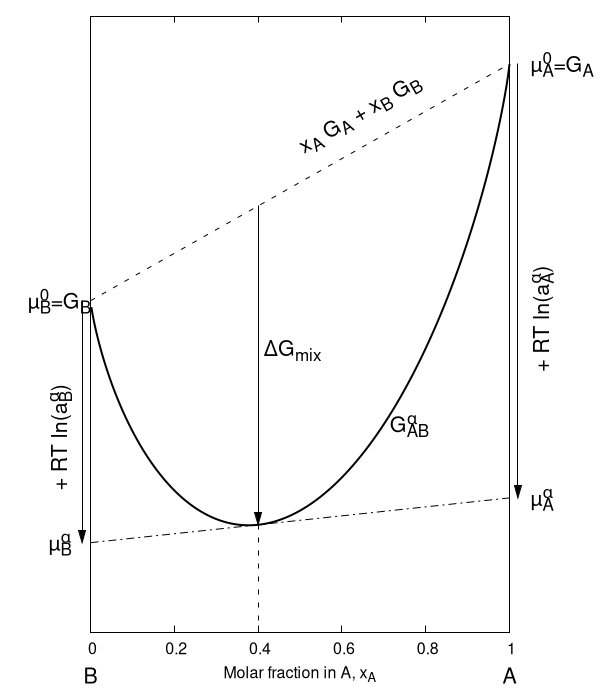

## Introduction

Following [10.1007/978-0-387-76424-5](https://dx.doi.org/10.1007/978-0-387-76424-5), in first approximation, a battery can actually be modeled as a simple reaction between two metallic materials, $A$ and $B$, reacting for example as $A + B \rightarrow AB$.

However, in a battery, $A$ and $B$ are electrode materials separated by an **electrolyte**. 
This electrolyte is specifically chosen to allow the transport of ionic species while acting as an electrical insulator. 

Therefore, for $A$ and $B$ to react, one of the species must either gain or lose electrons to be transported. 
These electrons, however, cannot travel directly through the electrolyte.
Instead, they move through an external electrical circuit to reach the other electrode.
This movement of electrons through the circuit is what powers devices and represents the working principle of a battery.
Note that ionic species and electrons must move at the same rate to maintain charge balance.

Let's assume that $A$ is the species being transported. The pathway is the following:

1. At the interface of electrode $A$, say that the following reaction occurs: $A \rightarrow A^+ + e^-$. $A$ is thus the **anode**.
2. The ion $A^+$ then moves through the electrolyte toward electrode $B$. 
3. At electrode $B$, the electron meet $A^+$ and a second reaction takes place: $A^+ + e^- \rightarrow A$, followed by $A + B \rightarrow AB$. $B$ is thus the **cathode**.

Schematically, one has:

```goat
+-----+-------------+-----+      +---+-------------+----+---+      +-------------+----------+
|  A  | electrolyte |  B  | -->  | A | electrolyte | AB | B | -->  | electrolyte |    AB    |
+-----+-------------+-----+      +---+-------------+----+---+      +-------------+----------+
```

During the charge/discharge process, at the cathode side, there are two phases: one containing $AB$ and another with $B$.

Note that the diffusion of $A$, $B$, and $e^-$ through $AB$ is necessary for the reaction to occur. 
Therefore, $AB$ must function as both an electrical and ionic conductor.

When the circuit is open, no reaction takes place, meaning the ionic species stop moving between the electrodes. 
This indicates that the chemical driving force acting on the ions is counterbalanced by another force, specifically, an electrostatic force.
The chemical driving force arises from the difference in chemical potential between the two electrodes, which corresponds to the $\Delta G_r$ of the reaction $A + B \rightarrow AB$ (the fact that $A$ gets transported from one side to the other is actually irrelevant here). 
The electrostatic force derived from the energy of a set of charge, by $-z\mathcal{F} E^0$, where $z$ is the charge number of the ionic species, $\mathcal{F}$ is the [Faraday constant](https://en.wikipedia.org/wiki/Faraday_constant), and $E^0$ is the (absolute) potential difference between the two electrodes.
The energy balance is expressed as:

$$\tag{1} \Delta G_r = -z\mathcal{F} E^0.$$

This is (one form of) the [Nernst equation](https://en.wikipedia.org/wiki/Nernst_equation).

Note that the formation reaction, $A + B \rightarrow AB$, where a new phase $AB$ forms alongside $B$, is not the only mechanism in battery operation.
Other mechanisms include:

+ **Displacement Reactions**: $A + BX \rightarrow AX + B$. 
  This involves the creation of a new phase containing $B$, for which the driving force is that the phase $AX$ is more stable than $BX$. 
  An example of this mechanism can be found in [CuS batteries](https://dx.doi.org/10.1002/aenm.202002394).
+ **Insertion Reactions**: $xA + BX \rightarrow A_xBX$. 
  In this case, $A$ is inserted into unoccupied sites within the structure of $BX$, forming a **solid solution** phase that exhibits a continuous range of compositions, *i.e.*, a range of $x$ values. 
  This is the working principle of many modern batteries, such as [lithium-ion batteries](https://en.wikipedia.org/wiki/Lithium-ion_battery) (originally utilizing cobalt oxide as the cathode, thought other oxides have since been explored).

```goat
+-----+-------------+-----+        +---+-------------+--+--+---+
|  A  | electrolyte | BX  | -+-->  | A | electrolyte |B |AX|BX |  (diplacement)
+-----+-------------+-----+  |     +---+-------------+--+--+---+
                             |
                             |     +---+-------------+-------+
                             +-->  | A | electrolyte | AₓBX  |    (insertion)
                                   +---+-------------+-------+
```

The potential along the charge/discharge process depends on the mechanism in place, and thus following $E^0$ alongside the charge/discharge process gives some information.
In this post, I will explore the (thermodynamic) reasons for that.

## A bit of thermodynamics

### The chemical potential

The [chemical potential](https://en.wikipedia.org/wiki/Chemical_potential) of a given species, $\mu_i$, represents the energy absorbed or released due to a change in the number of particles of that species:

$$\mu_i = \left(\frac{\partial G}{\partial n_i}\right)_{T,P,n\_{j\neq i}}.$$

Particles tend to move from regions of high chemical potential to regions of low chemical potential, as this reduces the system's (free) energy. 

Consider a system with two compartments, 1 and 2, separated by a membrane, containing species X at different concentrations. 
The movement of particles from compartment 1 to compartment 2 occurs such that $-dn_1 = dn_2$. 
The corresponding change in Gibbs free energy is:

$$dG = d(G_1+ G_2) = \mu_1dn_1 + \mu_2dn_2 = -(\mu_1-\mu_2)dn_2,$$

where $\mu_i$ is the chemical potential in compartment $i$ and we have used the relationship:

$$dG = \sum_i \mu_idn_i.$$

If $\mu_1 > \mu_2$, then $dG < 0$, indicating that the transfer from compartment 1 (high chemical potential) to compartment 2 (low chemical potential) decreases the total Gibbs free energy. 
Additionally, as particles move, the chemical potentials of the compartments adjust: $\mu_1$ decreases in compartment 1, and $\mu_2$ increases in compartment 2. At equilibrium, $\mu_1 = \mu_2$.

This thought experiment leads to a fundamental principle: **when two (or more) phases are at equilibrium, the chemical potential of any components is equal in all phases**.

Finally, in a solution, the chemical potential of $i$ only depends on temperature and pressure. 
This leads to:

$$\mu_i = \mu_i^0+RT\ln a_i,$$

where $a_i = \gamma_i x_i$ is the activity (an effective concentration), with $\gamma_i$ the [activity coefficient](https://en.wikipedia.org/wiki/Activity_coefficient), $x_i =n_i / \sum_j n_j$ the molar fraction of $i$ in solution and $\mu_i^0$ is the standard state chemical potential.
Therefore, $a_i\in[0,1]$ represent how "pure" compound $i$ is in solution.

From the definition of the chemical potential, it follows that **when two (or more) phases are at equilibrium, the activity of any components is the same in all phases**, provided that the activity is expressed with respect to the same standard state.

### The electrochemical potential

As noted in [10.1021/acsenergylett.0c02443](https://dx.doi.org/10.1021/acsenergylett.0c02443), the chemical potential does not account for the electrostatic contribution. 
Thus, the **electrochemical potential**, $\bar\mu_i$, is defined as:

$$\bar\mu_i = \mu_i + z_i \mathcal{F} \phi,$$

where $z_i$ is the charge of species $i$, and $\phi$ is the electrical potential in a given phase.

We can extend the principle of chemical equilibrium by stating that **when two (or more) phases are at equilibrium, the electrochemical potential of each component is equal across all phases**.
This principle is particularly useful in electrochemistry, where the electrochemical potential of electrons is often the focus. 
For example, the (relative) electrode or cell potential is defined by the difference between the electrochemical potential of the working electrode, $\bar\mu_e^{w}$, and that of a reference electrode, $\bar\mu_e^{ref}$:

$$E^0_{w} = -\frac{\bar\mu_e^{w} - \bar\mu_e^{ref}}{\mathcal{F}}.$$

Moreover, if the working electrode is in equilibrium with a redox couple $O/R$, where the reaction is $O + ne^- \rightarrow R$, then the electrochemical potentials of all species involved must be equal:

$$\bar\mu_e^{w} = \bar\mu_{O/R} \Rightarrow \bar\mu_e^s = \frac{\bar\mu_R - \bar\mu_O}{n},$$

where $\bar\mu_e^s$ is the electrochemical potential of the solution. 
This gives rise to the *solution* potential:

$$E^0 = -\frac{\bar\mu_e^s}{\mathcal{F}} = -\frac{\bar\mu_R - \bar\mu_O}{n\mathcal{F}},$$

which is another form of the Nernst equation (Eq. 1). 
In practice, since $\bar\mu_e^{w}$ is measured relative to a reference, $E^0$ is also defined with respect to a reference electrode.

With those tools in hand, let's address our different charge/discharge mechanisms.

### Thermodynamics of mixing in a single phase

Let's first consider the case of a single phase containing two components, $A$ and $B$. 
This could represent either a liquid phase or a [solid solution](https://en.wikipedia.org/wiki/Solid_solution) (often referred to as an [alloy](https://en.wikipedia.org/wiki/Alloy) in metallurgy).

The molar fraction of $A$ is denoted as $x_A$, while that of $B$ is $x_B = 1 - x_A$. 
The free energy of this system in a given phase, $\alpha$, is expressed as:

$$\tag{2} G^\alpha_{AB} = x_A\mu_A^\alpha + x_B\mu_B^\alpha.$$

Note that using the electrochemical potential, $\bar\mu_i$, instead of the chemical potential, $\mu_i$, would not change this result.

The free energy of mixing is the difference between the free energy of the individual components when separated and when mixed together as phase $\alpha$. This can be written as:

$$\Delta G_{mix} = G^\alpha_{AB} - G_A - G_B = x_A \Delta\mu_A^\alpha + x_B \Delta\mu_B^\alpha = RT(x_A \ln a^\alpha_A + x_B \ln a^\alpha_B),$$

where we have used the fact that $G_A = x_A \mu^0_A$, since the activity of pure $A$ is equal to 1.



**Figure:** Evolution of the free energy of phase $\alpha$ with $x_A$ (inspired by [10.1016/B978-0-444-53770-6.00003-4](https://doi.org/10.1016/B978-0-444-53770-6.00003-4)). 
The tangent (dashed line) illustrates that at a given $x$ (here $x=0.4$), $G^\alpha_{AB} = x_A\mu_A^\alpha + x_B\mu_B^\alpha$, and the intercept at $x=0$ and $x=1$ provides $\mu_A^\alpha$ and $\mu_B^\alpha$, repsectively. 

In an ideal solution (or Raoultian solution, where [Raoult's law](https://en.wikipedia.org/wiki/Raoult's_law) holds), we assume that $a_i = x_i$, so:

$$\Delta G_{mix}^{ideal} = RT[x_A \ln x_A + (1 - x_A) \ln (1 - x_A)]$$

In this case, the mixing process is purely entropic, since $\Delta H_{mix}^{ideal} = \Delta G_{mix}^{ideal} + T \Delta S_{mix}^{ideal} = 0$, with:

$$\Delta S_{mix} = -\left(\frac{dG_{mix}}{dT}\right)_P = -R[x_A \ln a^\alpha_A + x_B \ln a^\alpha_B].$$

This ideal solution model is an approximation (for example, it assumes that $\mu^0_A = \mu^0_B$), and deviations from ideal behavior are referred to as *excess properties*, such as the excess free energy of mixing, $\Delta G^e_{mix} = \Delta G_{mix} - \Delta G_{mix}^{ideal}$.
If the curve above is known, it would be possible to evaluate the activity by comparing to the ideal case.

Interestingly, this model is commonly used to describe insertion processes. 
As discussed in [10.1021/ar200329r](https://pubs.acs.org/doi/10.1021/ar200329r) (and others), the free energy of material $A_xBX$ with respect to the "concentration" of inserted species can be approximated as:

$$G_{A_xBX}(x) = G_{BX} + \varepsilon x + RT[x \ln x + (1 - x) \ln (1 - x)],$$

where $\varepsilon$ represents the free energy per added $A$ in the structure, and $x \in [0, 1]$ is the molar fraction of $A$ in $A_xBX$ (and thus $1-x$ is the fraction of holes). 
This range can be more restricted if the phase changes during the charging process, as described below. 
Here, we recognize the entropic term of an ideal solution. 
The corresponding elechtrochemical potential is:

$$\bar\mu_{A_xBX} = \frac{dG_{A_xBX}}{dx} + z\mathcal F\phi  =  \varepsilon + RT\ln\frac{x}{1-x} + z\mathcal F\phi.$$

This result can also be derived from statistical mechanics, using the definition of entropy $S = k_B \ln \Omega$ (see, *e.g.*, [this document](https://dspace.mit.edu/bitstream/handle/1721.1/100188/10-626-spring-2011/contents/lecture-notes/MIT10_626S11_lec07.pdf)).

From this expression, and using the Nernst equation, we can derive the variation of the potential:

$$E^0 = - \frac{1}{\mathcal F}\left[\varepsilon + RT \ln \frac{x}{1 - x} - \mu^0_{A}\right].$$


**Figure:** Evolution of the free energy of $A_xBX$ (top) and of the corresponding potential (bottom) with $x$ (inspired by [10.1021/ar200329r](https://pubs.acs.org/doi/10.1021/ar200329r)).
The potential is proportional to $dG(x)/dx$, as illustrated here for $x=0.55$.

The curve on the bottom is therefore representative of a charging curve for a single phase.

### Thermodynamic of two phases

Let's now consider that there are still two components, $A$ and $B$, but that there can be two phases, say $\alpha$ and $\beta$. 
For each of them, Eq. 2 is valid. 
One can therefore draw curves at different temperatures and observe their evolution:


**Figure:** Evolution of $G^\alpha$ and $G^\beta$ with the temperature, with $T_1 > T_2 > T_3$ (inspired by [10.1016/B978-0-444-53770-6.00003-4](https://doi.org/10.1016/B978-0-444-53770-6.00003-4)).

In addition, at equilibrium, the (electro)chemical potential of a given compound is equal, thus $\mu_A^\alpha = \mu_A^\beta$ and $\mu_B^\alpha = \mu_B^\beta$.

## Sources

+ *Advanced Batteries (Materials Science Aspects)* (book), [10.1007/978-0-387-76424-5](https://dx.doi.org/10.1007/978-0-387-76424-5).
+ Chapter 3 of *Physical metallurgy* (book), [10.1016/B978-0-444-53770-6.00003-4](https://doi.org/10.1016/B978-0-444-53770-6.00003-4).
+ *Potentially Confusing: Potentials in Electrochemistry*, [10.1021/acsenergylett.0c02443](https://dx.doi.org/10.1021/acsenergylett.0c02443).
+ *Understanding Li Diffusion in Li-Intercalation Compounds*, [10.1021/ar200329r](https://pubs.acs.org/doi/10.1021/ar200329r).
