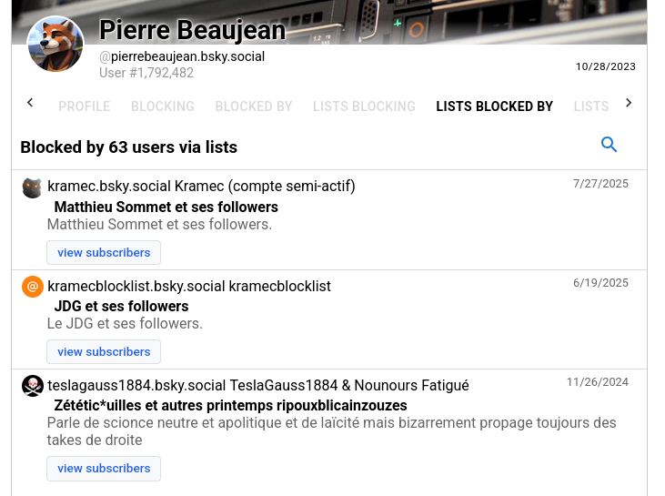

*Préambule : ceci est toujours mon avis, mon mien à moi. Encore une fois, je n’arrive pas aux mêmes conclusions que d’autres de mes contemporains, doooonc... c’est que je dois me tromper quelque part. Des commentaires constructifs ? Je vous promets que je vous lirai :)*
 ## Le malaise, mon malaise

Au moment où j’écris ce billet, j’ai 34 ans, et je suis titulaire d’un doctorat en chimie (enfin, "en sciences") depuis 5 ans. Je suis également post-doctorant, toujours en chimie, donc je connais et pratique la méthode scientifique (dans sa version la plus scolaire) du mieux que je peux. Je pense toujours qu’il s’agit d’une méthode qui a ses qualités pour produire des modèles et des prédictions robustes, même si la réalité est bien plus complexe que n’importe quel modèle ([« tous les modèles sont faux, mais certains sont utiles »](https://en.wikipedia.org/wiki/All_models_are_wrong) est probablement la phrase qui résume le mieux ma vision actuelle de la méthode scientifique et de ce qu’elle produit). J’ai par ailleurs énormément de griefs envers la manière dont le monde scientifique fonctionne (prépondérance d’éditeurs privés, financements dictés par des intérêts politiques, précarité, etc.), mais je ne dirais pas que la méthode scientifique en est la cause.

Mais je suis également un homme, et plus largement un citoyen (belge). J’ai donc aussi des opinions et des croyances, qui se situent globalement à gauche — malgré ce que [ma *blocklist* sur BlueSky](https://clearsky.app/pierrebeaujean.bsky.social/blocked-by-lists) (vous pouvez cliquer, c’est public, c’est le principe) pourrait laisser croire :

Bien que les deux premières listes soient de bonne guerre (déshonneur par association), la dernière m’embête. Pas tant pour y avoir été classé (les gens pensent ce qu’ils veulent de moi), mais surtout parce que les circonstances dans lesquelles j’y ai été ajouté ([tout est là](https://bsky.app/profile/pierrebeaujean.bsky.social/post/3kqcwno2i3q2g)) démontrent que, manifestement, j’ai un gros problème d’approche et de communication.

Et pourtant, je vous assure que je crois :

1. Que la science est politique, à minima parce qu’elle est faite par des humains qui ne sont pas neutres, et que de toute façon, la neutralité, ça n’existe pas (même si la méthode scientifique permet de se départir de certains biais — **mais pas tous**) ;
2. Que toutes les sciences se valent, que la distinction sciences humaines / sciences dures n’a que peu de sens, et que quand je dis "la science" dans le point précédent, ce n’est pas pour cacher la diversité des sciences, quelles qu’elles soient ; c’est juste que cette distinction n’a pas forcément de sens dans ce contexte (de toute façon, je ne suis pas hyper fan des classements et des étiquettes) ; et
3. Que la science n’a pas réponse à tout, et qu’elle n’est d’ailleurs pas la solution à tout — en particulier au réchauffement climatique.

Et là, normalement, même si aucun de ces points n’est une *take de droite* (loin de là, même), je vais probablement toujours être classé parmi les "zététic*uilles". Probablement parce que je n’ai pas employé les bons mots (oui, "la science"), parce que ce n’est pas suffisant ("Keuwa, tu n’abordes le technosolutionnisme qu’en TROISIÈME point ? Fachiste !"), voire parce que, selon tel courant politique dont je ne soupçonne même pas l’existence, j’ai quand même tout faux — parce que tout ça, c’est la faute du capitalisme, et qu’on ne peut pas être de gauche quand on profite d’une construction capitaliste comme la science ([et vice versa](https://www.youtube.com/watch?v=ZTeqM5gciH8&pp=ygUNZXQgdmljZSB2ZXJzYQ%3D%3D)).

Et il est là, mon malaise : je **n’arrive pas** à parler correctement de politique sans donner l’impression de dire l’inverse de ce que je pense. Je n’ai pas les bons termes, pas les bonnes expressions, et pas le bagage non plus (je suis chimiste, pas sociologue !). Et pourtant, c’est nécessaire : je suis de plus en plus inquiet ("seulement INQUIET ? Fachiste !") de la direction que prend la politique (belge, européenne, mondiale), qui se droitise et se radicalise toujours plus. Je ressens donc le besoin d’affiner mes connaissances en matière de politique (ce qui inclut la sociologie, donc) et d’apprendre à exprimer mes arguments convenablement. Voire de comprendre pourquoi certains de mes arguments sont faux, ce qui doit forcément être le cas.

Et c’est pas simple.

## Aparté : le langage

J’ai un problème avec le langage. Un vrai problème. Je **sais** que les mots ont un sens (parfois plusieurs, avec des nuances, des connotations, voire des sens cachés) et que c’est au moins aussi important en sciences (où l’on fait une fixette sur les définitions) que dans la vie de tous les jours (où l’on fait une fixette sur les étiquettes). Mais malgré ça, je n’y arrive pas. J’ai énormément de mal à trouver le bon mot au bon moment (surtout à l’oral), je confonds souvent les termes ou je les emploie comme synonymes. Pour compenser, je m’appuie beaucoup sur le contexte et les périphrases. Sauf que ça suggère que j'invisibilise à tour de bras, juste parce que j'ai pas utilisé le terme approprié.

De manière générale, je raisonne de façon très inductive : plutôt que de retenir des définitions, des concepts ou des résultats, je préfère me souvenir de quelques axiomes et du raisonnement qui m’y mène — ou au moins de la façon de le reconstruire si je l’ai oublié.

Ça peut sembler être une excuse facile. Ce n’en est pas une. C’est même assez handicapant au quotidien. Trois exemples :

1. J’ai énormément de mal à retenir les noms des gens. En revanche, je me souviens presque toujours du contexte dans lequel je les ai rencontrés, de ce qu’on a échangé et de pourquoi j’ai telle ou telle impression d’eux ;
2. Les subtilités de la grammaire et de l’orthographe, en français comme en anglais, m’échappent totalement. L'absence de logique interne et exceptions à rallonge me dépassent totalement (malgré que bien des profs qui s'y soient essayé). Même quand je me concentre, je n'arrive pas à sortir quelque chose de correct (et j'ai même tendance à la surcorection dans ce genre de cas). Par contre, j'adore l'accord de proximité, du coup (au moins c'est logique)...  Et, aussi ironique que ce soit, j’ai beau détester l’IA du plus profond de mon être, la qualité de mes textes s’est enfin améliorée grâce à elle. ("Keuwa ?! Fachiste va !"). 
3. Puis le langage, c’est quand même vachement imparfait : quand, pour parler de $\mathcal{G}$ (genre, « les êtres humains »), on dit « $A$ » (genre « les hommes »), alors que $A$ est un membre de $\mathcal{G}$ (et souvent le membre majoritaire), il y a forcément des confusions qui se font, et je tombe dedans à tout les coups.

Et bizarrement, pour le troisième point, plutôt que de se mettre d’accord sur un terme neutre pour $\mathcal{G}$ quand on veut en parler (genre… « les êtres humains », quoi), on a décidé que la solution, c’était de lister **tous** les membres de $\mathcal{G}$ — et attention, sans élisions, sinon c’est de l’invisibilisation (« les hommes, les femmes, les trans, les non-binaires, les intersexes … »). Je vous aime, mais on est tous-point-e-point-x différent-point-e-point-x et c'est très bien comme ça. Est ce que j'ai besoin de tous-point-e-point-x vous connaitre et nommer à chaque fois ? On peut pas collectivement se mettre d'accord sur un truc, renommer $\mathcal G$ pour que tous-point-e-point-x se sente inclu-point-e-point-x et dire ... "$\mathcal G$" ?

Bref, ça ne **m'**aide pas.

## *Back to business*

D’où ça vient, tout ça ? En ce qui me concerne, du COVID. Comme tout le monde, j’ai été plus ou moins affecté par cette période, mais j’y ai surtout vu à l’œuvre une opposition entre « la science » (oui, *la* science, en particulier la médecine dans ce cas-ci) et les vrais gens de la vraie vie. D’une part, la science, froide et rationnelle, recommandait le confinement, ce qui, de fait, devait fonctionner (supprimez la transmission, et le virus s’éteindra de lui-même en quelques semaines). D’autre part, ce confinement n’était ni matériellement possible (il aurait fallu isoler chaque personne, ce qui n’est pas réalisable), ni humainement souhaitable dans beaucoup de cas (la santé mentale de bien des gens, moi y compris, s’en est retrouvée durablement affectée). D’ailleurs, « la » science ne s’en est pas si bien sortie que ça, si on considère le « cas Raoult » ou toutes les polémiques autour des vaccins (ces plaies ne sont d’ailleurs pas encore refermées aujourd’hui).

C’est à ce moment-là que j’ai compris qu’effectivement, la science (oui, « la », la médecine encore une fois) n’avait pas la réponse à tout et que tout ça était hautement politique. D’ailleurs, ça n’a pas manqué, puisque malgré tout ce que pouvaient en dire les différents secteurs, c’étaient bien nos instances dirigeantes qui avaient le dernier mot. Bon, c’était à moitié une révélation : je suis un citoyen, je vois bien que la société fonctionne selon ses propres règles. N’empêche, voir cette opposition à l’œuvre m’a quand même ouvert l’esprit.

C’est également la période où la zététique, qui se place généralement en porte-étendard de « la science », a commencé à montrer ses faiblesses et ses limites. Je consomme de la zététique (au sens large, car certaines des personnes que je suis toujours s’en sont ensuite distanciées) depuis fort longtemps : en fait, déjà dans [ma période "Harry Potter"](../0004-homme-artiste), on m’avait offert le livre ["Devenez sorciers, devenez savants"](https://fr.wikipedia.org/wiki/Devenez_sorciers,_devenez_savants) de Henri Broch (celui-là même qui a remis la zététique au goût du jour) et Georges Charpak (ce qui n’est pas rien, quoiqu’on pourrait probablement l’accuser de ["nobélite"](https://fr.wikipedia.org/wiki/Maladie_du_Nobel) sur celle-là). C’est donc assez naturellement qu’en consommant des vulgarisateurs sur YouTube, j’ai fini par tomber sur des contenus zététiques.
Mais c’est surtout le COVID, et l’impact que celui-ci a eu dans la sphère zététique youtubienne francophone, qui m’a fait me détacher des zététiciens « neutres » (ou qui s’en revendiquent, vu que la neutralité, ça n’existe pas).
Puis bon, les concours du meilleur sophisme, ça m’a toujours laissé circonspect.

Le problème, c’est que [qu’en face](https://zet-ethique.fr/) (le célèbre blog ZEM), on passe plus de temps à critiquer la zététique telle qu’elle est pratiquée qu’à discuter de comment elle devrait l’être ... Quand ce n’est pas carrément pour *trasher* Thomas Durand ou autres, ce qui est probablement cathartique mais pas très intéressant quand c'est systématique et qu'on est moyennement concerné (le *drama*, c'est marrant 5 minutes, mais c'est généralement pas très constructif). Et pourtant, puisqu’ils annoncent s’attaquer au scientisme, au détour de différents articles, on retrouve parfois des petites phrases très intéressantes qui laissent sous-entendre qu’il y a plus à y comprendre, comme par exemple celle-ci, que j'aime beaucoup :

> *Ce qu’il faut garder en tête, c’est qu’un énoncé scientifique est nécessairement contaminé dès lors qu’il sort du champ scientifique.
> Il n’y a pas d’utilisation “pure” d’un énoncé scientifique en dehors du milieu scientifique.*
>
> (ça vient de [là](https://zet-ethique.fr/2019/08/09/psychologie-evolutionniste-1-representations-et-enjeux/)).

… Et c’est ça que je cherche. Sauf qu’aux évidences niaises des zététiciens neutres (« la science peut tout expliquer et l’esprit critique triomphe de tout »), on oppose un « non, parce que tout est politique » et… c’est quasiment tout. Vraiment, et j'imagine qu'il y a des choses qui m'ont échappée, mais j'en ressort avec l'impression que la plupart des articles sont des études de cas qui en arrivent tous à cette conclusion, sans aller plus loin (ça manque de "prescriptif" ?)

Par exemple, concernant la prise de décision (et la crise du COVID, mais pas que), j’ai lu pas mal d’articles dudit blog, comme [celui-là](https://zet-ethique.fr/2020/03/24/les-gens-pensent-mal-le-mal-du-siecle-partie-6-6-synthese-contre-la-technocratie/) (qui est le dernier d’une série que j’ai également lue), et la conclusion me semble être (mais je peux me tromper) qu’il faut, dans la prise d’une décision, favoriser la pluralité des opinions (et la pluralité des disciplines scientifiques) et mettre l’emphase sur celle des concernés.
Ce à quoi je réponds d’une part « faisons ça », mais d’autre part… « donc la solution, c’est le consensus mou ? »

Je veux dire, si on oublie un instant que les politiciens ne représentent qu’eux-mêmes, c’est déjà ce qui se passe au niveau d’un gouvernement.
Quand plusieurs partis forment une coalition, chacun émet ses arguments, ses lignes rouges et ses demandes ; on discute (et parfois, on invite même [les différents acteurs concernés](https://www.lesoir.be/595210/article/2024-06-14/vingt-cinq-thematiques-etudiees-pour-la-formation-du-gouvernement-wallon), même si c’est pour ensuite [cracher dessus](https://www.lalibre.be/belgique/2024/06/15/georges-louis-bouchez-mr-a-la-libre-on-va-gerer-le-pays-comme-des-ingenieurs-pas-comme-des-poetes-JXNBYYK6QRAKHDX2IDHPPFQLPU/)), et il en ressort un accord de gouvernement (on est d’accord qu’ici, on a oublié de mettre l’accent sur la voix des opprimés), c’est-à-dire une espèce de consensus mou auquel chacun trouve à redire.
J’ai l’impression, mais je peux me tromper, que même en rééquilibrant les voix en faveur des concernés, le consensus sera toujours insatisfaisant pour tout le monde (même les concernés !). J'ai aussi l'impression qu'aucun système politique (par exemple, la démocratie totalement participative [le système suisse aux hormones] ou la dicature de la minorité [ou seule les concernés prendrait des décisions les concernant] ou du prolétariat, ou que sais-je encore) n'est totalement satisfaisante à ce niveau là.

## Conclusions (?)

Pour ce qui est de « les sciences », je vais donc ajouter à la phrase « tous les modèles sont faux, mais certains sont utiles » la phrase « il n’y a pas d’utilisation *pure* d’un énoncé scientifique en dehors du milieu scientifique ». Je ne suis pas encore tout à fait au clair sur ce que ça implique pour moi (bien que ma recherche ne concerne absolument pas les êtres humains et soit même très déterministe en elle-même, je ne peux pas ignorer les impacts sociétaux qu’elle a ou pourrait avoir), mais j’y travaille.

Par contre, pour la prise de décision, je suis toujours dans le flou. J’ai l’impression que, même libérée des contraintes du système capitaliste (qui, certes, relâcherait certaines contraintes idiotes, genre [« toute décision doit maintenir le budget à l’équilibre »](https://droit.cairn.info/revue-revue-francaise-de-finances-publiques-2020-2-page-83)), la prise de décision restera toujours aussi insatisfaisante pour tout le monde (puisque, comme le rappelle bien touuuuuuut le monde, « la prise de décision cherche à atteindre un but, qui est lui-même politique »). J’avoue que me dire que la solution, c’est qu’il n’y a pas de solution satisfaisante, ça ne m’aide pas trop à vouloir affiner mes positions politiques (puisque du coup, à quoi bon ?).

Ou alors, c’est que je suis fasciste ?
