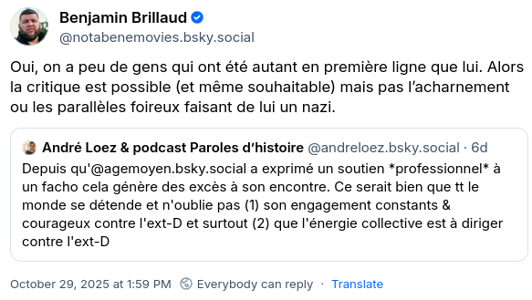



Après avoir fini [mon précédent billet](../0005-sos-scientifique/) (d'ailleurs pas très clair, ce qui traduit bien ma confusion quand à ces sujets), je m'attendais à retourner ruminer mes réflexions pendant quelques mois.
Et puis il c'est passé [ça](https://bsky.app/profile/agemoyen.bsky.social/post/3m4af45mbz22q) et [ça](https://bsky.app/profile/notabenemovies.bsky.social/post/3m4ditzzrys2g) (et d'autres trucs du même gout) :

Le thème, qui tourne autour du [paradoxe de la tolérance](https://fr.wikipedia.org/wiki/Paradoxe_de_la_tol%C3%A9rance), est très simple : "on ne discute pas avec l'extrême droite". 
Ou en fait, plus concrètement, "ne pas dénoncer l'extrème droite, c'est la tolérer".
