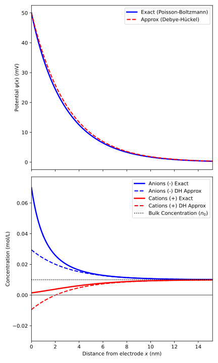
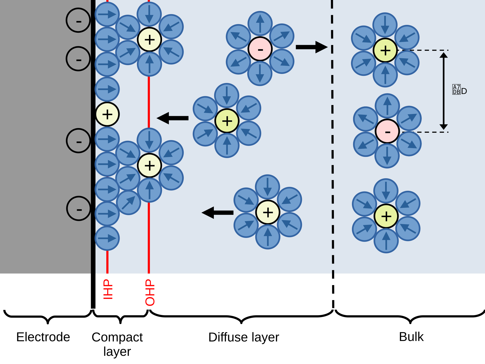
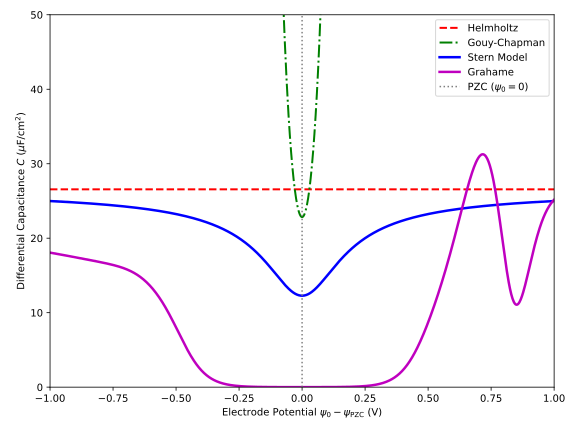
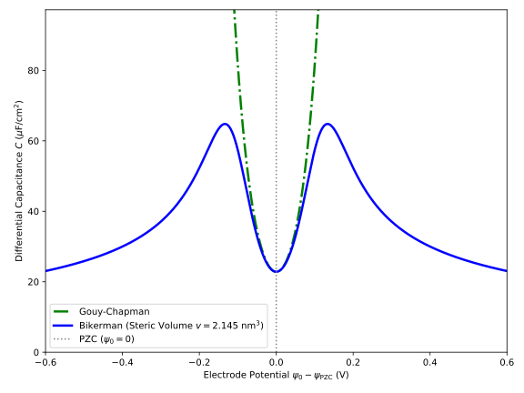

You know what this blog misses? Science.
Let's do science.

Today, I would like to disentangle a concept that often comes up in my work on batteries: the [*electrical double layer*](https://en.wikipedia.org/wiki/Double_layer_%28surface_science%29).
While this concept originates from the study of capacitors, it has many applications, including in battery science. 
Here, it tells us something about the organization of ions and solvents near an electrode, and about how the electric field and potential extend into the bulk.
So, this might come in handy when studying reactions at interfaces, like what I'm trying to do in [my recent publication](https://dx.doi.org/10.1039/D6TA02841A) on the topic.

Note, however, that I will mostly focus on the continuum models developed to describe this behavior, which come with their own issues.
We'll have a look at those at the end.

## But first, (electric) capacitors!

According to [Wikipedia](https://en.wikipedia.org/wiki/Capacitor):

> A capacitor is a device that stores electrical energy by accumulating electric charges on two closely spaced surfaces that are insulated from each other.

When a potential difference is applied across the two plates of a capacitor, charges accumulate on them, creating an electric field between the plates. 
The charges on the two plates have opposite signs and therefore attract each other.
Thanks to the insulator, or, rather, the **dielectric**, between the two plates, no charge can flow from one plate to the other. 
The capacitor can therefore store electrical energy as long as the potential difference is maintained.
When the potential is removed, the stored energy can be released.

Capacitors are characterized by their **capacitance**, given by the ratio of the charge stored on each plate to the applied voltage.
Since the charge can depend on the voltage, a differential form is sometimes more useful, defined as

$$C = \frac{dQ}{dV}.$$

For a simple parallel-plate capacitor, the capacitance can be computed as

$$C = \varepsilon_0\varepsilon_r\frac{A}{d},$$

where $A$ is the area of the plates and $d$ is the distance between them.

But why do we care?

Well, because one of the simplest ways of thinking about what happens at an electrode–electrolyte interface is to see it as something that looks pretty much like a capacitor.
When the potential applied to the electrode differs from its [potential of zero charge](https://en.wikipedia.org/wiki/Point_of_zero_charge#Application_in_electrochemistry) (PZC), charge builds up at its surface. At a potential lower than the PZC, this excess surface charge is negative.
As a consequence, charges of the opposite sign in the electrolyte are attracted towards the surface, creating... two layers of opposite charge.
So, we have a capacitor. 
And a pretty good one, since $d$ is of the order of an Angstrom.
In fact, when well tuned, one might create [supercapacitors](https://en.wikipedia.org/wiki/Supercapacitor) based on this principle.

We will see below that this picture may be a bit too simple.
However, that has not prevented electrochemists from defining a differential capacitance for this situation, written as

$$C_{dl} = \frac{d\sigma_M}{d\psi_0},$$

where $\sigma_M$ is the surface charge density and $\psi_0$ is the electrode potential.

## Continuum models for the EDL: the basics

We begin with the **one-dimensional Poisson equation**, which governs the electrostatic potential $\psi(x)$ at a distance $x$ from a flat electrode surface:

$$\frac{d^2\psi(x)}{dx^2}=-\frac{\rho(x)}{\varepsilon},$$

where $\rho(x)$ is the local volume charge density and $\varepsilon=\varepsilon_0\varepsilon_r$ is the dielectric permittivity of the solvent.
In the following, it will be assumed that the potential in the solution is zero, so that $\lim_{x\to\infty} \psi(x) = 0$.

### Derivation of the Helmholtz model

Let's start with the simplest possible model of the EDL: the **Helmholtz model**.

The basic idea is very simple. 
We assume that the counter-ions form a rigid, compact layer at a fixed distance $x=d$ from the electrode surface. 
This distance is generally taken to be the **distance of closest approach**, since short-range repulsive interactions, such as Pauli repulsion, prevent the ions from getting any closer to the electrode.

In the region between the electrode ($x=0$) and the ion layer ($0<x<d$), there are no free charges in the solution. Therefore, $\rho(x)=0$, and the Poisson equation reduces to the one-dimensional **Laplace equation**:

$$\frac{d^2\psi}{dx^2}=0.$$

Integrating once with respect to $x$ gives

$$\frac{d\psi}{dx}=C_1.$$

Since the electric field is related to the potential through

$$E=-\frac{d\psi}{dx},$$

the electric field in the gap is constant.

Integrating once more gives the expected linear potential profile:

$$\psi(x)=C_1x+C_2.$$

We can now apply the appropriate boundary conditions.

1. At the electrode surface ($x=0$), the potential is $\psi_0$:

   $$\psi(0)=\psi_0,$$

   and therefore

   $$\psi_0=C_1(0)+C_2\quad\Longrightarrow\quad C_2=\psi_0.$$

2. At the plane of closest approach ($x=d$), we take the potential of the bulk solution as our reference, so that

   $$\psi(d)=0.$$

   This gives

    $$0=C_1d+\psi_0\quad\Longrightarrow\quad C_1=-\frac{\psi_0}{d}.$$

Substituting these constants into the potential profile gives

$$\psi(x)=\psi_0\left(1-\frac{x}{d}\right).$$

The potential therefore decreases linearly from $\psi_0$ at the electrode to zero at the ion layer.

We can now connect this potential profile to the surface charge density. From Gauss's law, the surface charge density on the electrode, $\sigma_M$, is related to the electric field at the electrode surface:

$$\sigma_M=-\varepsilon\left.\frac{d\psi}{dx}\right|_{x=0}.$$

Using the potential profile above,

$$\sigma_M=\varepsilon\frac{\psi_0}{d}.$$

Finally, differentiating the surface charge density with respect to the electrode potential gives the **Helmholtz differential capacitance**:

$$C_H=\frac{d\sigma_M}{d\psi_0}=\frac{\varepsilon}{d}.$$

In other words, the Helmholtz model is really a parallel-plate capacitor in disguise: the electrode provides one charged plate, while the compact counter-ion layer provides the other.

### Gouy–Chapman Model Derivation

While the Helmholtz model (which dates back to about 1850) assumed that counter-ions form a rigid layer at a fixed distance from the electrode, the **Gouy–Chapman model** (~1910), in light of the devellopment of the Debye-Hückel theory, takes a very different approach: ions are treated as point charges that are free to move in the solution and are assumed to be in thermal equilibrium.
Thus, their local number concentration $n_i(x)$ therefore follows a **Boltzmann distribution** in response to the local electrostatic potential $\psi(x)$:

$$n_i(x)=n^0_i\exp\left[-\frac{z_i e\psi(x)}{k_B T}\right] = n_0\exp[-\beta z_ie\psi(x)],$$

where $z_i$ is the valence of ion $i$, $e$ is the elementary charge, $k_B$ is the Boltzmann constant, $T$ is the temperature, and $\beta = (k_B T)^{-1}$. 
Here, $n_0$ is the bulk number concentration of each ionic species.

For a symmetric $z:z$ electrolyte, with $z_\pm=\pm z$ and $n_+^0 = n_-^0 = n_0$, the two ionic concentrations are therefore

$$n_+(x)=n_0\exp[-\beta ze\psi(x)],\qquad n_-(x)=n_0\exp[\beta ze\psi(x)].$$

The local charge density is then, using the definition of [hyperbolic sine](https://en.wikipedia.org/wiki/Hyperbolic_functions#Exponential_definitions) [$\sinh x = \frac{1}{2}(e^x-e^{-x})$]:

$$\rho(x)=ze\left[n_+(x)-n_-(x)\right]=-2zen_0\sinh[\beta ze\psi(x)].$$

Substituting this expression into the Poisson equation gives the **Poisson–Boltzmann equation**:

$$\frac{d^2\psi}{dx^2}=\frac{2zen_0}{\varepsilon}\sinh[\beta ze\psi(x)].$$

This equation is nonlinear, so we need to do a little more work than in the Helmholtz case.

To obtain a first integral, we multiply both sides by $2,d\psi/dx$:

$$2\frac{d\psi}{dx}\frac{d^2\psi}{dx^2}=\frac{4zen_0}{\varepsilon}\sinh[\beta ze\psi(x)]\frac{d\psi}{dx}.$$

The left-hand side can be recognized as the derivative of $(d\psi/dx)^2$. Integrating both sides with respect to $x$ gives

$$\left(\frac{d\psi}{dx}\right)^2=\frac{4n_0}{\beta\varepsilon}\cosh[\beta ze\psi(x)]+C.$$

We can now use the boundary conditions in the bulk solution, far away from the electrode ($x\rightarrow\infty$):

$$\psi\rightarrow0,\qquad\frac{d\psi}{dx}\rightarrow0.$$

Since $\cosh(0)=1$, we obtain

$$0=\frac{4n_0}{\beta\varepsilon}+C\quad\Longrightarrow\quad C=-\frac{4n_0}{\beta\varepsilon}.$$

Therefore,

$$\left(\frac{d\psi}{dx}\right)^2=\frac{4n_0}{\beta\varepsilon}\left[\cosh(\beta ze\psi)-1\right].$$

Using the identity $\cosh(y)-1=2\sinh^2(y/2)$, this becomes

$$\left(\frac{d\psi}{dx}\right)^2=\frac{8n_0}{\beta\varepsilon}\sinh^2\left(\frac{\beta ze\psi}{2}\right).$$

Taking the negative square root, since the potential decreases with distance from a positively charged electrode, gives

$$\frac{d\psi}{dx}=-\sqrt{\frac{8n_0}{\beta\varepsilon}}\sinh\left(\frac{\beta ze\psi}{2}\right).$$

We can now connect the potential to the charge on the electrode. 
From Gauss's law, the surface charge density on the metal electrode, $\sigma_M$, is related to the electric field at the electrode surface:

$$\sigma_M=-\varepsilon\left.\frac{d\psi}{dx}\right|_{x=0}.$$

At the electrode surface, $x=0$ and $\psi=\psi_0$, so

$$\sigma_M=\sqrt{\frac{8\varepsilon n_0}{\beta}}\sinh\left(\frac{\beta ze\psi_0}{2}\right).$$

The **Gouy–Chapman differential capacitance** is obtained by differentiating the surface charge density with respect to the surface potential:

$$C_{\mathrm{GC}}=\frac{d\sigma_M}{d\psi_0}=\sqrt{2\beta z^2e^2\varepsilon n_0}\cosh\left(\frac{\beta ze\psi_0}{2}\right).$$

We can make this expression a little more intuitive by introducing the inverse **Debye screening length**,

$$\kappa=\sqrt{\frac{2\beta z^2e^2n_0}{\varepsilon}}.$$

The Gouy–Chapman capacitance then takes the particularly simple form

$$C_{\mathrm{GC}}=\varepsilon\kappa\cosh\left(\frac{\beta ze\psi_0}{2}\right).$$

The $\cosh$ term tells us something interesting: unlike the Helmholtz capacitance, the Gouy–Chapman capacitance is not constant. 
It increases with the magnitude of the electrode potential. In fact, we will see below that it has a characteristic parabola-like shape.

The characteristic length scale is therefore the [**Debye length**](https://en.wikipedia.org/wiki/Debye_length#In_an_electrolyte_solution), $\lambda_D=1/\kappa$.
Note that it is inversely proportional to the square root of the concentration, $n_0$, which means that when $n_0\to\infty$, $\lambda_D\to0$.
This is, obviously, unphysical. There is, however, an interesting limiting case, called the Debye-Hückel limit. 
When the surface potential is small, such that $\beta ze\psi_0\ll1$, we can use the approximation $\sinh(y)\approx y$. The electric-field equation then becomes

$$\frac{d\psi}{dx}\approx-\kappa\psi.$$

Integrating from the electrode surface, where $x=0$ and $\psi=\psi_0$, gives an exponential decay:

$$\psi(x)=\psi_0e^{-\kappa x}.$$

In the linearized Gouy–Chapman model, the electrostatic potential is screened exponentially over roughly $\lambda_D$.
Finally, given that $e^{x}\approx 1 +x$,

$$n_\pm(x)=n_0\exp[\mp\beta z_ie\psi(x)]\approx n_0\left[1\mp z_ie\psi(x)\right].$$

This is already quite different from the Helmholtz picture. Instead of a sharp, compact layer of counter-ions at a fixed distance, the Gouy–Chapman model gives us a **diffuse layer**, in which the ionic concentrations gradually return to their bulk values as we move away from the electrode.

### Numerical results

Before turning to more "realistic" models (we'll see what this means), let's have a look at the evolution of $\psi(x)$ and $n_i(x)$ in the Gouy–Chapman model.

Notice that, apart from the limiting case, we never obtained an explicit analytical expression for $\psi(x)$. 
This is simply because the Poisson–Boltzmann equation is nonlinear and does not have a simple closed-form solution in the general case.

So, [this script](https://github.com/pierre-24/blog.pierrebeaujean.net/tree/master/content/posts/0008-edl/plot_GC.py) solves the equation numerically and compares the result with the analytical solution obtained in the Debye–Hückel limit.
For numerical purposes, it is convenient to rewrite the Poisson–Boltzmann equation in terms of dimensionless variables. 
Defining $\tilde{x}=\kappa x$ and $\tilde{\psi}=ze\beta\psi$, gives

$$\frac{d^2\tilde{\psi}}{d\tilde{x}^2}=\sinh(\tilde{\psi}).$$

The result, using $\psi_0=50$ mV and $n_0=0.01$ M in water ($\varepsilon_r=78.4$), is shown below:

The top panel shows the evolution of the electrostatic potential. 
The Debye–Hückel approximation (dashed line) follows the numerical solution quite closely, but the two are not identical, with the largest deviations appearing at intermediate distances from the electrode.
Under these conditions, the Debye length is approximately $\lambda_D\approx3$ nm. This gives a useful estimate of the spatial extent of the diffuse layer: the potential decays exponentially, and lose half its value, over a characteristic length of roughly one Debye length. 
At a few Debye lengths from the electrode, the potential is therefore already very close to its bulk value.

The bottom panel shows the evolution of the anion and cation concentrations. 
Since the electrode is positively charged, anions are attracted towards the surface, while cations are depleted. 
In the Gouy–Chapman model, the ions are treated as point charges, so the counter-ion concentration actually diverges as the electrode surface is approached. 
This is, of course, unphysical and is one of the main limitations of the model.
Further away from the electrode, both concentrations gradually return to their bulk value, $n_0$. 
Again, the Debye–Hückel approximation follows the full numerical solution reasonably well away from the electrode. 
However, because it relies on a linearization of the Boltzmann distribution, it can predict unphysical concentrations near a strongly charged electrode, including negative concentrations for the depleted species.

This is a nice illustration of both the usefulness and the limitations of the Gouy–Chapman model. 
The continuum description captures the overall structure of the diffuse layer remarkably well, but its treatment of ions as point charges eventually breaks down precisely where the interfacial effects become strongest.

What can we do about that?

## Improved models

### The Stern Model

The Gouy–Chapman model gives us a much more realistic picture of the EDL than the Helmholtz model: ions are not confined to a single plane but form a **diffuse layer** whose concentration gradually approaches the bulk value.
However, it also comes with an important limitation. 
By treating ions as point charges, the Gouy–Chapman model allows them to approach the electrode arbitrarily closely. 
At sufficiently large surface potentials, this can lead to unrealistically high counter-ion concentrations near the electrode (and, for that matter, capacitance).

The **Stern model** provides a simple way to fix this by simply combining the two models. 
Close to the electrode, ions cannot approach beyond a certain distance because of their finite size and short-range repulsive interactions. 
This creates a compact, charge-free region, just as in the Helmholtz model. 
Beyond this region, ions are free to distribute themselves according to the Gouy–Chapman model.
In other words, the EDL is divided into two regions:

1. A **compact layer**, extending from the electrode surface at $x=0$ to the plane of closest approach at $x=d$.
2. A **diffuse layer**, extending from $x=d$ into the bulk solution.

The potential therefore drops partly across the compact layer and partly across the diffuse layer.
There is no free charge in the solution between $x=0$ and $x=d$, so the potential satisfies the Laplace equation given above.
As in the Helmholtz model, this gives a linear potential profile. 
However, we now need to distinguish between the electrode potential $\psi_0$ and the potential at the beginning of the diffuse layer, which we will call $\psi_d=\psi(d)$.

The potential drop across the compact layer is therefore, starting from the expression found in the Helmotz model, given by:

$$\sigma_M=\varepsilon_c\frac{\psi_0-\psi_d}{d} \Leftrightarrow \psi_0-\psi_d=\frac{\sigma_Md}{\varepsilon_c}.$$

This can be rearranged to give

$$\sigma_M=C_H(\psi_0-\psi_d),$$

where we recognize $C_H$ from above.
So far, this is exactly the same result as before. The difference is that $\psi_d$ is no longer assumed to be zero: the diffuse layer still has a finite potential at $x=d$.
Then, beyond the plane of closest approach, the Gouy–Chapman model applies. 
We can therefore reuse the result derived above, but with $\psi_d$ instead of $\psi_0$ as the potential at the beginning of the diffuse layer.

The charge density associated with the diffuse layer is

$$\sigma_M=\sqrt{\frac{8\varepsilon_{\mathrm{bulk}}n_0}{\beta}}\sinh\left(\frac{\beta ze\psi_d}{2}\right).$$

The Stern model is therefore obtained by combining the compact-layer and diffuse-layer contributions.
We can write the relationship between the electrode potential and the diffuse-layer potential as

$$\psi_0=\psi_d+\frac{\sigma_M}{C_H}.$$

Substituting the Gouy–Chapman expression for $\sigma_M$ gives an implicit equation for $\psi_d$:

$$\psi_0=\psi_d+\frac{1}{C_H}\sqrt{\frac{8\varepsilon_{\mathrm{bulk}}n_0}{\beta}}\sinh\left(\frac{\beta ze\psi_d}{2}\right).$$

This equation generally cannot be inverted analytically to obtain $\psi_d$ as an explicit function of $\psi_0$. But that is not really a problem: it already gives us the full Stern model, and $\psi_d$ can be obtained numerically for any given electrode potential.

We can go one step further and derive the differential capacitance of the complete EDL.
Since the potential in the electrolyte is zero, the total potential drop is equivalent to the sum of the potential drops across the compact and diffuse layers:

$$\psi_0=\frac{\sigma_M}{C_H}+\psi_d.$$

Differentiating with respect to $\sigma_M$ gives

$$\frac{d\psi_0}{d\sigma_M}=\frac{1}{C_H}+\frac{d\psi_d}{d\sigma_M}.$$

The second term is simply the inverse of the Gouy–Chapman differential capacitance evaluated at $\psi_d$:

$$C_{\mathrm{GC}}(\psi_d)=\frac{d\sigma_M}{d\psi_d}.$$

Therefore,

$$\frac{d\psi_0}{d\sigma_M}=\frac{1}{C_H}+\frac{1}{C_{\mathrm{GC}}(\psi_d)} \Leftrightarrow \frac{1}{C_{\mathrm{S}}}=\frac{1}{C_H}+\frac{1}{C_{\mathrm{GC}}(\psi_d)}.$$

This looks exactly like two capacitors connected in series.

The analogy is not accidental. The compact layer and the diffuse layer each sustain part of the total potential drop, and the same surface charge passes through both. Their capacitances therefore combine in series.

For the compact layer, the Helmholtz capacitance is

$$C_H=\frac{\varepsilon_{\mathrm{H}}}{d},$$

where $\varepsilon_{\mathrm{H}}$ is the permittivity of the compact layer and $d$ is its thickness.
For the diffuse layer, the Gouy–Chapman capacitance is

$$C_{\mathrm{GC}}(\psi_d)=\varepsilon_{\mathrm{bulk}}\kappa\cosh\left(\frac{\beta ze\psi_d}{2}\right),$$

where $\varepsilon_{\mathrm{bulk}}$ is the bulk solvent permittivity and $\kappa$ is the inverse Debye length.

We therefore finally obtain

$$\frac{1}{C_{\mathrm{S}}}=\frac{d}{\varepsilon_{\mathrm{H}}}+\frac{1}{\varepsilon_{\mathrm{bulk}}\kappa\cosh\left(\frac{\beta ze\psi_d}{2}\right)}.$$

There is a small but important subtlety here: the Stern capacitance is not simply obtained by putting $\psi_0$ into the Gouy–Chapman expression. The Gouy–Chapman contribution depends on the potential **at the beginning of the diffuse layer**, $\psi_d$, rather than directly on the electrode potential $\psi_0$.
This distinction becomes increasingly important as the compact-layer potential drop becomes significant.

The Stern model therefore gives us a useful compromise between the two limiting pictures.
At low potentials, or when the compact layer is very thin, the diffuse layer can dominate and the model approaches the Gouy–Chapman picture.
Conversely, if the diffuse-layer capacitance becomes very large, the compact layer becomes the limiting contribution:

$$C_{\mathrm{GC}}\gg C_H\quad\Longrightarrow\quad C_{\mathrm{S}}\approx C_H.$$

In this limit, most of the potential drop occurs across the compact layer, and the EDL behaves approximately like a Helmholtz capacitor.

### Grahame's Extension and the Helmholtz Planes (IHP & OHP)

In 1947, David C. Grahame refined the Stern model to account for the fact that some ions can lose part of their solvation shell and adsorb specifically onto the electrode surface, while others remain fully solvated. This led to a distinction between two planes within the compact part of the EDL: the **Inner Helmholtz Plane (IHP)** and the **Outer Helmholtz Plane (OHP)**.

The interface is divided along the spatial coordinate $x$, taken perpendicular to the electrode surface at $x=0$.

1. **Inner Helmholtz Plane (IHP), at $x=x_{\mathrm{IHP}}$**.

   The IHP is the locus of the centers of **specifically adsorbed ions**. These ions are typically partially or completely desolvated and can interact directly with the metal through short-range chemical and non-electrostatic interactions. Because these interactions are not purely electrostatic, specifically adsorbed ions can, in principle, adsorb even when they have the same sign of charge as the electrode.

   The region between the metal surface and the IHP, $0<x<x_{\mathrm{IHP}}$, also contains strongly oriented solvent molecules, particularly water dipoles.

2. **Outer Helmholtz Plane (OHP), at $x=x_{\mathrm{OHP}}$**.

   The OHP is the locus of the centers of **non-specifically adsorbed ions** at their distance of closest approach to the electrode. These ions retain their primary solvation shell and are assumed to interact with the electrode primarily through long-range electrostatic forces.

3. **Diffuse layer, $x>x_{\mathrm{OHP}}$**.

   Beyond the OHP, ions are free to distribute themselves according to the electrostatic potential. This region is described by the Gouy–Chapman Poisson–Boltzmann model and extends continuously into the bulk solution.

The total charge of the interface must vanish. 
If $\sigma_M$ is the charge density on the metal, $\sigma_{\mathrm{IHP}}$ is the charge density associated with specifically adsorbed ions, and $\sigma_d$ is the integrated charge density of the diffuse layer, electroneutrality requires

$$\sigma_M+\sigma_{\mathrm{IHP}}+\sigma_d=0.$$

This equation is useful because it separates the charge stored in the different parts of the EDL.

Between the metal and the IHP, there is no volume charge in the continuum description. The potential therefore obeys the Laplace equation. If the dielectric permittivity in this region is $\varepsilon_{\mathrm{IHP}}$, the electric field is constant and determined by the metal surface charge:

$$\frac{d\psi}{dx}=-\frac{\sigma_M}{\varepsilon_{\mathrm{IHP}}}.$$

Integrating from the metal surface, where $\psi(0)=\psi_0$, to the IHP, where $\psi(x_{\mathrm{IHP}})=\psi_{\mathrm{IHP}}$, gives, as in the Stern model above,

$$\psi_0-\psi_{\mathrm{IHP}}=\frac{\sigma_Mx_{\mathrm{IHP}}}{\varepsilon_{\mathrm{IHP}}}.$$

The IHP itself is represented as a sheet of charge, $\sigma_{\mathrm{IHP}}$. The electric field therefore changes discontinuously across this plane according to Gauss's law. If the permittivity immediately on either side is taken to be the same, this gives

$$\left.\frac{d\psi}{dx}\right| _ {x _ {\mathrm{IHP}}^+}-\left.\frac{d\psi}{dx}\right| _ {x _ {\mathrm{IHP}}^-}=-\frac{\sigma_{\mathrm{IHP}}}{\varepsilon_{\mathrm{OHP}}}.$$

Consequently, in the region between the IHP and OHP, the field is determined by the total charge enclosed between the metal and that point:

$$\frac{d\psi}{dx}=-\frac{\sigma_M+\sigma_{\mathrm{IHP}}}{\varepsilon_{\mathrm{OHP}}}.$$

The potential drop between the two Helmholtz planes is therefore

$$\psi_{\mathrm{IHP}}-\psi_{\mathrm{OHP}}=\frac{(\sigma_M+\sigma_{\mathrm{IHP}})(x_{\mathrm{OHP}}-x_{\mathrm{IHP}})}{\varepsilon_{\mathrm{OHP}}},$$

where $\psi_{\mathrm{OHP}}=\psi(x_{\mathrm{OHP}})$ is the potential at the OHP.

Putting the two compact regions together gives the total potential drop between the electrode and the OHP:

$$\psi_0-\psi_{\mathrm{OHP}}=(\psi_0-\psi_{\mathrm{IHP}})+(\psi_{\mathrm{IHP}}-\psi_{\mathrm{OHP}})=\frac{\sigma_Mx_{\mathrm{IHP}}}{\varepsilon_{\mathrm{IHP}}}+\frac{(\sigma_M+\sigma_{\mathrm{IHP}})(x_{\mathrm{OHP}}-x_{\mathrm{IHP}})}{\varepsilon_{\mathrm{OHP}}}.$$

This is essentially the Grahame extension of the compact-layer contribution derived above for the Stern model. The key difference is that the charge in the IHP is no longer simply part of a fixed counter-charge layer: $\sigma_{\mathrm{IHP}}$ can itself vary with the electrode charge.

We can therefore define the **compact-layer capacitance** as

$$C_{\mathrm{compact}}=\frac{\partial\sigma_M}{\partial(\psi_0-\psi_{\mathrm{OHP}})}.$$

Differentiating the potential drop above gives

$$C_{\mathrm{compact}}=\left[\frac{x_{\mathrm{IHP}}}{\varepsilon_{\mathrm{IHP}}}+\frac{x_{\mathrm{OHP}}-x_{\mathrm{IHP}}}{\varepsilon_{\mathrm{OHP}}}\left(1+\frac{d\sigma_{\mathrm{IHP}}}{d\sigma_M}\right)\right]^{-1}.$$

The expression for $C_{\mathrm{compact}}$ contains the key new ingredient introduced by Grahame: **specific adsorption**. If $\sigma_{\mathrm{IHP}}$ changes significantly with the electrode charge, the compact-layer capacitance can deviate strongly from the simple Helmholtz prediction.

This also has an important consequence for the experimentally measured differential capacitance. Specific adsorption can produce pronounced features in the capacitance: if the amount of specifically adsorbed charge changes rapidly with electrode potential, the term $d\sigma_{\mathrm{IHP}}/d\sigma_M$ can become large, strongly modifying the compact-layer response and producing the characteristic **capacitance humps** observed experimentally.

There is another useful distinction here. The compact and diffuse contributions have different physical origins. The compact-layer contribution is determined primarily by the interfacial structure and adsorption properties, whereas the diffuse-layer contribution depends strongly on the electrolyte concentration through the Debye screening length.

This separation is conceptually useful. Changing the salt concentration should primarily modify the diffuse-layer contribution, while changing the electrode material, solvent structure, or specific adsorption chemistry can modify the compact-layer contribution.

So far, however, we have only considered the region up to the OHP. For $x>x_{\mathrm{OHP}}$, the Gouy–Chapman description takes over. The diffuse layer starts at the OHP, so the relevant surface potential in the Poisson–Boltzmann solution is now $\psi_{\mathrm{OHP}}$, rather than the metal potential $\psi_0$.

The charge density in the diffuse layer is

$$\sigma_d=-\sqrt{\frac{8\varepsilon_{\mathrm{bulk}}n_0}{\beta}}\sinh\left(\frac{\beta ze\psi_{\mathrm{OHP}}}{2}\right).$$

The corresponding diffuse-layer capacitance is, once again,

$$C_{\mathrm{GC}}(\psi_{\mathrm{OHP}})=\varepsilon_{\mathrm{bulk}}\kappa\cosh\left(\frac{\beta ze\psi_{\mathrm{OHP}}}{2}\right),$$

where $\kappa$ is the inverse Debye length.

We can now regard the Grahame model as two capacitive contributions in series: the **compact layer**, extending from the metal to the OHP and containing the IHP, and the **diffuse layer**, extending beyond the OHP. Since the same interfacial charge must be balanced across the two regions, their differential capacitances combine in series.

The total differential capacitance of the Grahame model, which we denote by $C_G$, is therefore

$$\frac{1}{C_G}=\frac{1}{C_{\mathrm{compact}}}+\frac{1}{C_{\mathrm{GC}}(\psi_{\mathrm{OHP}})}.$$

Unlike the simple Helmholtz capacitance of the Stern model, however, the compact-layer capacitance is not simply determined by the thickness and dielectric permittivity of the layer. The reason is that the charge associated with specifically adsorbed ions can itself change as the electrode charge changes.

The important point is that the EDL is no longer just a question of electrostatics. Once we distinguish the IHP from the OHP, we are implicitly acknowledging that **ion–surface interactions, solvation, and specific adsorption** can affect the structure of the interface.

### Numerical result break

Let's see how all of this looks in practice.

To numerically simulate the Grahame model, we need to specify how the compact layer responds to the potential drop between the electrode and the OHP. Rather than explicitly modeling the microscopic structure of the IHP and the solvent, we can describe this response phenomenologically through an **integral capacitance** of the compact layer, which we will denote by $K_{\mathrm{comp}}$.

There is an important distinction here. We cannot simply prescribe an arbitrary differential capacitance curve and insert it into the charge-balance equations. The charge stored in the compact layer must first be defined from its integral capacitance:

$$\sigma_{\mathrm{comp}}=K_{\mathrm{comp}}(\Delta\psi)\Delta\psi,$$

where

$$\Delta\psi=\psi_0-\psi_{\mathrm{OHP}}$$

is the potential drop across the compact layer, from the metal surface to the OHP.

The corresponding **differential compact-layer capacitance** is then obtained by differentiating the stored charge with respect to this potential drop:

$$C_{\mathrm{comp}}=\frac{d\sigma_{\mathrm{comp}}}{d\Delta\psi}=K_{\mathrm{comp}}(\Delta\psi)+\Delta\psi\frac{dK_{\mathrm{comp}}}{d\Delta\psi}.$$

For this numerical example, I will use the following phenomenological form for the integral capacitance:

$$K_{\mathrm{comp}}(\Delta\psi)=K_{\mathrm{base}}+K_{\mathrm{asym}}(\Delta\psi)+K_{\mathrm{hump}}(\Delta\psi).$$

Using parameters expressed in $\mu\mathrm{F/cm^2}$, for standard electrochemical readability, this becomes

$$K_{\mathrm{comp}}(\Delta\psi)=25.0+4.0\tanh(4.0\Delta\psi)+12.0\exp\left[-\left(\frac{\Delta\psi-0.15}{0.10}\right)^2\right].$$

Here, $\Delta\psi$ is expressed in volts.

The three terms have distinct physical interpretations:

* **The baseline term, $K_{\mathrm{base}}$:** A constant value of $25.0\ \mu\mathrm{F/cm^2}$. 
  This represents the baseline dielectric response of the compact interfacial region, including the strongly confined solvent layer between the electrode and the solvated ions.
* **The solvent asymmetry term, $K_{\mathrm{asym}}$:** The term $4.0\tanh(4.0\Delta\psi)$ introduces a smooth asymmetry around the point of zero charge. 
  It is a simple phenomenological way of representing the fact that the structure and orientation of interfacial solvent molecules can depend on the sign of the electrode potential. In particular, water dipoles can adopt different configurations depending on whether the surface is positively or negatively charged, changing the effective dielectric response of the compact layer.
* **The specific-adsorption hump, $K_{\mathrm{hump}}$:** The Gaussian term $12.0\exp[-((\Delta\psi-0.15)/0.10)^2]$ introduces a localized enhancement centered at $\Delta\psi=+0.15$ V, with a characteristic width of $0.10$ V. 
  It phenomenologically represents the enhanced charge-storage response associated with a specific adsorption process occurring over a limited potential range. For example, anions such as chloride or bromide can become specifically adsorbed at positive potentials, accompanied by partial desolvation and strong interaction with the electrode surface. 
  The Gaussian is not meant to be a microscopic adsorption model; it simply provides a convenient way of introducing a localized adsorption feature into the compact-layer response.

The following graph, obtained with [this script](https://github.com/pierre-24/blog.pierrebeaujean.net/tree/master/content/posts/0008-edl/plot_capa.py), shows the resulting differential capacitance as a function of the electrode potential relative to the point of zero charge.

The different models illustrate progressively more elaborate descriptions of the EDL.

The **Helmholtz model** gives a constant capacitance: by construction, the compact layer behaves as a simple dielectric capacitor with a fixed thickness and dielectric permittivity.

The **Gouy–Chapman model**, on the other hand, predicts a minimum capacitance around zero potential and an increasingly large capacitance at higher potentials. This is a direct consequence of the diffuse layer: at low surface charge, the counter-ion cloud extends over a relatively large distance, whereas increasing the surface potential compresses the diffuse layer and increases its capacitance. At sufficiently high potentials, the Gouy–Chapman capacitance diverges because the model treats ions as point charges.

The **Stern model** remedies this divergence by placing a compact layer in series with the diffuse layer. 
Since the compact-layer capacitance remains finite, it limits the total capacitance at high potentials. 
The resulting curve retains the characteristic minimum around zero potential but approaches a finite value at large $|\psi_0|$, given by the Helmholtz model.

The **Grahame model** adds another layer of realism by allowing the compact-layer response itself to depend on the potential. 
In this phenomenological example, the solvent asymmetry makes the curve asymmetric, while the specific-adsorption term produces a pronounced hump at positive potentials.
The important point is that this last feature does not come from the diffuse layer at all. It is introduced through the potential-dependent response of the compact layer, and therefore provides a simple way of representing the effects of solvent reorganization and specific adsorption that are absent from the simpler continuum models.

Of course, the particular functional form used here is deliberately phenomenological. The Gaussian hump, for instance, is not a microscopic theory of adsorption. It is simply a convenient way to illustrate how additional interfacial physics can be incorporated into the Grahame framework—and how that physics can leave a clear signature in the differential capacitance.

## Volume exclusion: the Bikerman model

So, in all these models, the diffuse layer is still treated using Gouy–Chapman.
And this model has one particularly obvious problem: it treats ions as point charges.
As we saw in the numerical example, this means that the counter-ion concentration can diverge as the electrode surface is approached.

Clearly, real ions cannot be compressed indefinitely. At some point, their finite size must matter.
A simple way to account for this is to introduce **volume exclusion**. 
One of the simplest models doing so is the **Bikerman model**, which treats the electrolyte as a lattice gas: the solution is divided into small volume elements, each of which can be occupied by at most one ion.
The idea is simple. 
Instead of allowing the local concentration to increase without limit according to the Boltzmann distribution, we impose a maximum concentration corresponding to the available volume.

For simplicity, let's consider a symmetric $z:z$ electrolyte in which cations and anions have the same molecular volume $v$. In the bulk, each ionic species has concentration $n_0$, so the bulk volume fraction occupied by ions is

$$\phi_0=2vn_0.$$

The remaining fraction, $1-\phi_0$, is occupied by solvent.

For a lattice gas, the chemical potential contains not only the electrostatic contribution but also an entropic contribution associated with the finite number of available sites.
At equilibrium, the electrochemical potential of each ionic species must be constant. 
This gives

$$\frac{n_i(x)}{1-v[n_+(x)+n_-(x)]}=\frac{n_0}{1-2vn_0}\exp(-\beta z_i e\psi(x)).$$

The denominator is the important new ingredient. It accounts for the fraction of volume that remains available to the ions.

For the symmetric electrolyte, using once again the dimensionless potential $\tilde{\psi}=\beta ze\psi$, we can easily solve the two equations simultaneously to obtain

$$n_\pm(x)=\frac{n_0e^{\mp\tilde{\psi}}}{1+2vn_0[\cosh(\tilde{\psi})-1]}.$$

Compare this with the ordinary Gouy–Chapman result: the exponential Boltzmann factor is still there, but it is now divided by a common denominator. 
As the potential becomes large, this denominator grows as well and prevents the concentrations from diverging.

The local charge density consequently becomes

$$\rho(x)=ze[n_+(x)-n_-(x)]=-\frac{2zen_0\sinh(\tilde{\psi})}{1+2vn_0[\cosh(\tilde{\psi})-1]}.$$

Substituting this expression into Poisson's equation gives the **modified Poisson–Boltzmann equation**:

$$\frac{d^2\psi}{dx^2}=\frac{2zen_0}{\varepsilon}\frac{\sinh(\beta ze\psi)}{1+2vn_0[\cosh(\beta ze\psi)-1]}.$$

This looks rather more complicated than the usual Poisson–Boltzmann equation, but, as for the Gouy–Chapman model, it can still be integrated once analytically.
After following the same steps as before and applying the bulk boundary conditions, the surface charge is obtained as

$$\sigma_M=\operatorname{sgn}(\psi_0)\sqrt{\frac{2\varepsilon}{\beta v}\ln\left[1+2vn_0\left(\cosh(\beta ze\psi_0)-1\right)\right]}.$$

This expression is already enough to see the main effect of volume exclusion.

At low surface potentials, the model should recover Gouy–Chapman. 
Indeed, if the ionic volume fraction remains sufficiently small that

$$2vn_0[\cosh(\tilde{\psi}_0)-1]\ll1,$$

we can use $\ln(1+y)\approx y$, giving

$$\sigma_M\approx\operatorname{sgn}(\psi_0)\sqrt{4\varepsilon n_0k_BT[\cosh(\tilde{\psi}_0)-1]}.$$

Using $\cosh(\tilde{\psi}_0)-1=2\sinh^2(\tilde{\psi}_0/2)$, this becomes

$$\sigma_M\approx\sqrt{8\varepsilon n_0k_BT}\sinh\left(\frac{\tilde{\psi}_0}{2}\right),$$

for the corresponding sign of $\psi_0$. 
We therefore recover exactly the Gouy–Chapman result.

So the Bikerman model does not replace Gouy–Chapman everywhere. 
It modifies it precisely where the finite size of the ions becomes important.

And the difference becomes striking at large $|\psi_0|$.

In Gouy–Chapman, the counter-ion concentration grows exponentially with the surface potential. In the Bikerman model, however, the denominator grows at the same time. The concentration therefore approaches a finite limit instead of diverging.

For example, for a strongly positive electrode, the anion concentration approaches

$$n_-(x)\rightarrow\frac{1}{v},$$

while the cation concentration tends towards zero.

The value $1/v$ has a simple interpretation: it is the **maximum concentration allowed by the lattice model**. Once essentially all available volume is occupied by counter-ions, increasing the potential cannot compress them any further.

This also has an important consequence for the differential capacitance.

The differential capacitance follows directly by differentiating the surface charge with respect to the electrode potential, $C_{\mathrm{B}}=d\sigma_M/d\psi_0$. 
Starting from the Bikerman surface-charge relation above, this gives

$$C_{\mathrm B}=\varepsilon\kappa\sinh(\tilde{\psi}_0)\frac{\sqrt{vn_0}}{\left(1+2vn_0[\cosh(\tilde{\psi}_0)-1]\right)\sqrt{\ln\left[1+2vn_0[\cosh(\tilde{\psi}_0)-1]\right]}}.$$

In the limit $v\rightarrow0$, this reduces to the Gouy–Chapman differential capacitance (but you have to be careful in the derivation).

At large potentials, unlike the Gouy–Chapman model, the capacitance no longer diverges because the counter-ion concentration is limited by the finite available volume.
The counter-ion layer eventually reaches a crowded, nearly saturated state, and the capacitance no longer grows exponentially.

A rough estimate for the onset of steric effects is therefore obtained from

$$2vn_0[\cosh(\tilde{\psi}_0)-1]\sim1.$$

For a dilute electrolyte, this corresponds approximately to $\cosh(\tilde{\psi}_0)\sim1/(vn_0)$, which gives a characteristic potential of roughly

$$|\psi_0|_{\mathrm{steric}}\sim\frac{1}{\beta ze}\ln\left(\frac{1}{vn_0}\right).$$

Beyond this regime, ion crowding becomes important and the Bikerman capacitance can reach a maximum before decreasing at higher potentials, in contrast to the unbounded growth predicted by Gouy–Chapman.

It is demonstrated in this image, obtained using [this script](https://github.com/pierre-24/blog.pierrebeaujean.net/tree/master/content/posts/0008-edl/plot_bikerman.py):

Of course, the Bikerman model is still a continuum model. 
It introduces finite ion size in a phenomenological way, but it does not explicitly describe molecular packing, solvent structure, ion–ion correlations, or specific adsorption. 
In particular, the asymmetry between the adsorption of positive and negative ions, which can be introduced through *ad hoc* expressions in the Grahame model, is not captured by this basic version of the Bikerman model.

In other words, we have fixed one of the problems of Gouy–Chapman, but certainly not all of them.

## Conclusion

And this is becoming a recurring theme with EDL models: each additional piece of physics makes the model more realistic, but also introduces another set of assumptions.

As far as I can tell, one natural direction is to extend the Bikerman model by introducing ion-specific sizes, adsorption, and other interactions. 
The Bikerman model successfully addresses the unphysical crowding of point-like ions in the diffuse layer by introducing volume exclusion. 
But when we want to describe specific adsorption and the resulting structure of the compact layer, we need more elaborate models, such as adsorption isotherms that account for localized ion–surface interactions and, potentially, lateral interactions between adsorbed ions.

Another route is to abandon the relatively simple continuum description and formulate the problem in terms of an explicit free-energy functional that accounts for intermolecular interactions. 
This leads us towards **classical density functional theory (cDFT)**, which provides a more microscopic description of the structure of the EDL while remaining, in a sense, a continuum theory of the underlying molecular densities.

Of course, this comes at the cost of yet another layer of complexity and assumptions. There is probably no single "correct" EDL model: the appropriate level of description depends on which physical effects one wants to capture and, just as importantly, which ones one is willing to neglect.

----

The scripts for this post, including the code used to generate the figures, are available [here](https://github.com/pierre-24/blog.pierrebeaujean.net/tree/master/content/posts/0008-eld).

**Sources:**

* Wikipedia, ["Double layer"](https://en.wikipedia.org/wiki/Double_layer_%28surface_science%29), and references therein.
* Wu, J. Understanding the Electric Double-Layer Structure, Capacitance, and Charging Dynamics. *Chem. Rev.* **2022**, *122* (12), 10821–10859. https://doi.org/10.1021/acs.chemrev.2c00097.
* Borukhov, I.; Andelman, D.; Orland, H. Steric Effects in Electrolytes: A Modified Poisson–Boltzmann Equation. *Phys. Rev. Lett.* **1997**, *79* (3), 435–438. https://doi.org/10.1103/PhysRevLett.79.435.
* Wang, X.-P.; Liu, K.; Wu, J. Demystifying the Stern Layer at a Metal–Electrolyte Interface: Local Dielectric Constant, Specific Ion Adsorption, and Partial Charge Transfer. *J. Chem. Phys.* **2021**, *154* (12), 124701. https://doi.org/10.1063/5.0043963.
* Doronin, S. V.; Budkov, Y. A. Electric Double Layer: From Classical Stern-like Models to Advanced Continuum Theories. *Curr. Opin. Electrochem.* **2026**, *57*, 101853. https://doi.org/10.1016/j.coelec.2026.101853.

